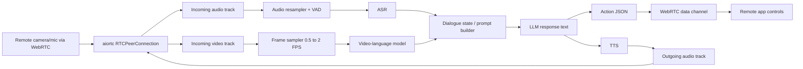
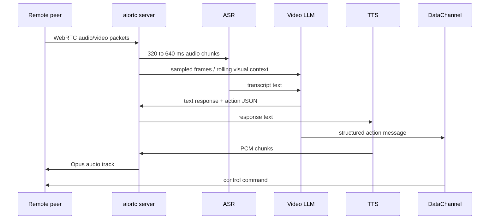

# Open-Source Video and Audio LLM Stacks for a Single 24GB GPU

## Executive summary

The most practical answer for a **single 24GB GPU** is **not** a monolithic “one model does everything” design. Today’s open end-to-end omni models are impressive, but the most reliable low-resource architecture is still a **modular stack**: a small video-language model for frames/video, a dedicated ASR model for audio, and a lightweight TTS engine for speech output, all stitched together through a WebRTC server such as `aiortc`. In the sources reviewed, that architecture consistently gives the best mix of **VRAM headroom, debuggability, controllability, and RTC integration simplicity**. citeturn36view0turn32view0turn40view0turn39view0turn10view0

If you want the most practical implementation today, I would recommend one of these two paths:

**Default recommendation for production on 24GB:** **MiniCPM-V 4.6 + faster-whisper + Kokoro or CosyVoice**, using `aiortc` and PyAV/FFmpeg around it. MiniCPM-V 4.6 has an official **4 GB GPU** footprint, with **3 GB** official BNB/AWQ/GPTQ variants, and supports video understanding through the current Transformers stack. `faster-whisper` is a mature Whisper reimplementation with strong CUDA benchmarks and bundled FFmpeg via PyAV. Kokoro is only **82M parameters** and Apache-licensed; CosyVoice is heavier but officially supports streaming TTS with latency “as low as 150 ms.” citeturn36view0turn35view0turn40view0turn39view0turn41view1

**Best single-model omni option on 24GB:** **MiniCPM-o 4.5 AWQ or GGUF**. OpenBMB’s official table lists **19 GB** for the full model, **11 GB** for AWQ, and **10 GB** for the GGUF GPU build, and the project explicitly documents **full-duplex omnimodal live streaming** with a low-resource path targeting NVIDIA GPUs with **at least 12 GB** of GPU memory. The trade-off is maturity: the PyTorch full web demo still asks for **28 GB** VRAM, and the project’s own limitations note that omni-mode speech output can still be unstable. citeturn36view0turn35view1turn25view4

I would **not** make **Qwen2.5-Omni-3B** my first 24GB recommendation unless you specifically want to experiment with native speech generation from a single model. Qwen’s official memory table shows **18.38 GB** BF16 for a **15 s** video, **22.43 GB** for **30 s**, and warns that real-world usage is “typically at least **1.2× higher**,” which effectively makes 24GB feasible only for **short rolling context windows** with careful tuning. citeturn34view0

I would also rule out **Qwen3-Omni-30B-A3B** for this target. Qwen’s official README lists **78.85 GB** BF16 for a **15 s** video on the Instruct model, far beyond a 24GB card. citeturn19search3

## Candidate stacks compared

| Stack | Modality support | VRAM footprint on 24GB target | Real-time latency for RTC | Pros | Cons | Official repos and license |
|---|---|---|---|---|---|---|
| **MiniCPM-V 4.6 + faster-whisper + Kokoro** | Video/image/text via MiniCPM-V; audio input via Whisper-family ASR; TTS via Kokoro | **MiniCPM-V 4.6:** 4 GB GPU, **3 GB** BNB/AWQ/GPTQ. Add **Whisper small ~2 GB** or **turbo ~6 GB**; Kokoro is tiny by comparison. Total practical stack usually stays well under 24GB. citeturn36view0turn29view2turn39view0 | **Estimated** end-to-end: about **0.5–1.5 s** with 320–640 ms ASR chunks and 1 FPS video sampling | Best headroom; easy to debug; clean separation of video reasoning, ASR, and TTS; strong official framework support | Not a single-model solution; you must manage synchronization yourself | MiniCPM repo, Apache-2.0. faster-whisper repo, MIT. Kokoro repo, Apache-2.0. citeturn16view4turn40view0turn39view0 |
| **Qwen2.5-VL-3B-AWQ + faster-whisper + Kokoro or CosyVoice** | Native video/image/text in Qwen2.5-VL; external ASR and TTS | Official AWQ checkpoint is published; Qwen recommends FlashAttention-2 and decord for fast video loading. Exact VRAM is not formally tabulated on the model card; for low-FPS RTC windows this is a comfortable 24GB fit in practice, especially with AWQ. citeturn32view0turn24search2turn12view3turn27search3 | **Estimated** about **0.7–2.0 s** depending on visual token budget | Strongest small-stack choice if you need **agentic visual control**, stable JSON, and tool-friendly outputs | No native speech output; VRAM is more prompt/token sensitive than MiniCPM-V 4.6 | Qwen2.5-VL model card and repo, Apache-2.0. faster-whisper MIT. Kokoro Apache-2.0 or CosyVoice Apache-2.0. citeturn16view0turn22view0turn40view0turn39view0turn41view1 |
| **MiniCPM-o 4.5 AWQ or GGUF** | Native text, image, audio, video input; native text and speech output; full-duplex live streaming | Official table: **19 GB** full GPU, **11 GB AWQ**, **10 GB GGUF GPU**. Low-resource live-streaming path officially targets NVIDIA GPUs with **at least 12 GB**. citeturn36view0turn35view1 | **Estimated** about **0.4–1.2 s** for speech-first interaction; somewhat higher with active video | Best open single-model fit for 24GB; real full-duplex design; official low-resource path | PyTorch demo still asks for **28 GB**; official limitations mention unstable speech output in omni mode | MiniCPM repo, Apache-2.0. citeturn35view1turn16view4 |
| **Qwen2.5-Omni-3B** | Native text, image, audio, video input; native text and speech output | Official theoretical minimum: **18.38 GB** BF16 for **15 s** video, **22.43 GB** for **30 s**, with actual use typically **≥1.2×**. On 24GB this is only safe for short rolling windows. citeturn34view0 | Official materials describe real-time streaming speech generation; on 24GB expect **tight** latency/memory trade-offs | Elegant one-model design; best official Qwen omni docs; official Docker and vLLM examples | Memory headroom is poor on 24GB; operationally more brittle than modular stacks | Qwen2.5-Omni repo and model card, Apache-2.0. citeturn33view1turn16view2 |
| **SmolVLM2-2.2B or 500M + Whisper + Kokoro** | Native video/image/text in SmolVLM2; external ASR/TTS | Model family comes in **2.2B, 500M, 256M** sizes and supports video in Transformers; this is the smallest serious video-first route here. citeturn13view0turn37view3 | **Estimated** about **0.4–1.2 s** if prompts are short and the video window is small | Excellent for truly low-resource hardware; has official MLX support too | Weaker reasoning and control robustness than Qwen/MiniCPM options | SmolVLM2 Apache-2.0; Kokoro Apache-2.0; Whisper-family MIT. citeturn16view1turn39view0turn29view2 |

### What I would actually deploy

If the goal is a practical local assistant that watches an RTC stream, listens, talks back, and emits control actions, I would rank the options like this:

**Best overall:** **MiniCPM-V 4.6 + faster-whisper + Kokoro**. It keeps the vision model tiny, leaves enough VRAM for ASR and buffering, and avoids the memory cliffs of all-in-one omni models. MiniCPM-V 4.6 is explicitly positioned by OpenBMB as its most edge-friendly model, with official quantized variants and official support across Transformers, vLLM, SGLang, llama.cpp, and Ollama. citeturn36view3turn35view0

**Best if action/control JSON matters most:** **Qwen2.5-VL-3B-AWQ + faster-whisper + Kokoro/CosyVoice**. Qwen2.5-VL is unusually strong for control-plane work because the official model card calls out **tool-directed agent behavior**, **video understanding**, and **stable JSON outputs** for coordinates and attributes. citeturn32view0

**Best if you insist on one model:** **MiniCPM-o 4.5 AWQ/GGUF**, not Qwen2.5-Omni-3B. On official numbers, MiniCPM-o leaves materially more VRAM headroom on 24GB. citeturn36view0turn34view0

## Memory, latency, quantization, and framework trade-offs

A single 24GB GPU is enough for serious local multimodal work, but the bottleneck is **not just model weights**. It is the combined cost of **visual tokens, KV cache, audio buffers, and TTS generation state**. That is exactly why the modular stacks are easier to keep stable: the VLM sees a sparse frame stream, ASR sees compact 16 kHz mono chunks, and TTS runs independently. Qwen’s own omni docs make this visible: memory rises sharply as video duration grows from 15 s to 30 s to 60 s. citeturn34view0

For quantization, the practical knobs in the reviewed sources are **AWQ, GPTQ, bitsandbytes 4-bit/8-bit, GGUF, and FP8**, not pruning. Hugging Face’s current quantization docs explicitly support **AWQ**, **GPTQ**, and **bitsandbytes** 4-bit/8-bit loading, and Qwen and MiniCPM both publish official quantized checkpoints or quantization guidance. In the official deployment materials I reviewed, quantization is the main optimization path; I did not find first-party structured pruning guidance that looked production-ready for these multimodal stacks. citeturn27search3turn27search0turn27search6turn36view0turn22view0

On frameworks, **PyTorch is the clear default recommendation**. Qwen2.5-Omni, Qwen2.5-VL, MiniCPM-V/o, Whisper-family integrations, and Kokoro/CosyVoice are all documented primarily around **PyTorch/Transformers**, `vLLM`, `SGLang`, or `llama.cpp`. SmolVLM2 is notable because Hugging Face also shipped it with **MLX** support from day zero, but that is an Apple-Silicon path, not a JAX recommendation. In the official sources reviewed here, I did **not** find a comparably mature first-party **JAX** deployment path for the top 24GB candidates, so JAX would add unnecessary porting work. citeturn33view2turn32view0turn35view0turn13view0

For latency, the highest-confidence concrete number in the sources is on the TTS side: **CosyVoice 3.0** says its bi-streaming mode can reach latency **as low as 150 ms**. On the ASR side, `faster-whisper` publishes concrete GPU benchmarks on an RTX 3070 Ti 8GB, including **59 s** to transcribe **13 minutes** of audio with `large-v2` at **int8** and **2926 MB** VRAM, which is comfortably faster than real time. That is why, in practice, the **video-language model tends to be the bottleneck**, not ASR or TTS. citeturn41view1turn40view0

### TTS options that make sense on 24GB

**Kokoro** is the easiest lightweight TTS answer. The repo describes it as an **82M-parameter** open-weight TTS model with **Apache-licensed weights**, and its reference examples use `espeak-ng` plus a Python pipeline that emits **24 kHz** audio. That makes it attractive for local deployment, but you should remember to resample to Opus-friendly WebRTC audio before sending it out. citeturn39view0

**CosyVoice** is the stronger choice if you care about **streaming speech quality and low start latency** more than absolute minimal footprint. Its repo is Apache-2.0, and it explicitly advertises **text-in streaming** plus **audio-out streaming** with **latency as low as 150 ms**. It is heavier than Kokoro, so I would pick it only if your GPU budget still looks healthy after VLM and ASR allocation. citeturn41view1

**Piper** remains a valid pure-local fallback, especially if you want predictable CPU-only synthesis and do not need the newest neural voice style. However, the original `rhasspy/piper` repository is now **archived**, even though it remains **MIT-licensed**. That makes it more of a conservative fallback than a future-facing recommendation. citeturn14view1

## RTC integration architecture

If you terminate WebRTC in Python, `aiortc` gives you the right primitives:

- `RTCRtpReceiver` manages **reception and decoding** of incoming media. citeturn31view1
- `MediaStreamTrack.recv()` yields the next `AudioFrame`, `VideoFrame`, or packet. citeturn31view0
- `RTCPeerConnection.addTrack()` lets you send your generated TTS audio back to the peer. `createDataChannel()` lets you send structured control messages. citeturn10view0

That means the clean WebRTC pattern is:

1. Receive audio/video tracks from the browser or remote peer.
2. Pull frames with `recv()` into small queues.
3. Sample video frames sparsely for the VLM.
4. Resample audio into short mono chunks for ASR.
5. Merge ASR text plus a rolling visual state into the LLM prompt.
6. Emit:
   - **text** for logs/UI,
   - **JSON actions** over the WebRTC data channel,
   - **PCM audio** from TTS as a custom outgoing audio track.



For video decoding, the answer depends on where the media comes from:

- For **live WebRTC tracks**, `aiortc` already handles RTP receive/decode and gives you decoded frames. citeturn31view1turn31view0
- For **file/URL/video side inputs**, model-specific tooling matters. Qwen2.5-VL recommends `qwen-vl-utils[decord]` and falls back to `torchvision`; Qwen2.5-Omni recommends `qwen-omni-utils[decord]`; MiniCPM-V 4.6 now documents either `torchcodec` or **PyAV** for video decoding in Transformers. citeturn12view1turn33view2turn36view3

For audio decoding, there are two good patterns:

- Use **PyAV/FFmpeg** in places where you are opening files, recordings, or external container formats. FFmpeg itself is usually **LGPL** by default, though enabling certain optional parts can make the whole build **GPL**. citeturn30search0turn31view2
- Use `faster-whisper`, which explicitly says system FFmpeg is **not required** because audio is decoded through **PyAV**, which bundles FFmpeg libraries. citeturn40view0

### Recommended RTC message contract

For low-latency control, do **not** send free-form prose over the data channel. Have the model produce a very small JSON schema, for example:

```json
{
  "type": "action",
  "name": "set_camera_preset",
  "args": {
    "preset": "speaker_closeup"
  },
  "confidence": 0.92
}
```

Qwen2.5-VL is particularly good here because its model card explicitly calls out **stable JSON outputs** and agent behavior for tool-directed tasks. citeturn32view0



## Minimal stack and deployment recipes

### Minimal hardware and software stack

For a no-specific-constraint deployment that is still realistic on a 24GB GPU, I would standardize on:

- **OS:** Ubuntu 22.04 or 24.04. Linux is the path of least resistance for CUDA, `decord`, FlashAttention, and most of the official Docker examples. Qwen’s utility packages explicitly note that `decord` may not install from PyPI on non-Linux systems, and faster-whisper’s documented Docker base is `nvidia/cuda:12.3.2-cudnn9-runtime-ubuntu22.04`. citeturn12view1turn33view2turn40view0
- **GPU:** one NVIDIA GPU with **24GB VRAM**.
- **CPU:** I would budget **8 modern CPU threads** as a comfortable target for WebRTC, queueing, resampling, VAD, and light preprocessing. That is an engineering recommendation rather than a first-party minimum.
- **System RAM:** **32 GB minimum**, **64 GB preferred**, especially if you experiment with CPU offload or multiple processes.
- **Core libraries:** Python 3.10 or 3.11, PyTorch, Transformers, aiortc, av, faster-whisper, and one TTS engine. `faster-whisper` requires Python **3.9+** and CUDA **12 + cuDNN 9** for current GPU builds. citeturn40view0

### Minimal Docker base

```dockerfile
FROM nvidia/cuda:12.3.2-cudnn9-runtime-ubuntu22.04

RUN apt-get update && apt-get install -y \
    python3 python3-pip python3-venv git ffmpeg espeak-ng libsndfile1 \
    && rm -rf /var/lib/apt/lists/*

RUN python3 -m pip install --upgrade pip

# Core runtime
RUN pip install \
    torch torchvision torchaudio \
    transformers accelerate bitsandbytes \
    aiortc av soundfile resampy \
    faster-whisper \
    kokoro>=0.9.4

# If using Qwen2.5-VL
RUN pip install qwen-vl-utils[decord]==0.0.8

# If using MiniCPM-V 4.6 without torchcodec
RUN pip install "transformers[torch]>=5.7.0"
```

This layout aligns with the official dependency patterns from `faster-whisper`, Qwen2.5-VL, Qwen2.5-Omni, and MiniCPM-V 4.6. citeturn40view0turn12view1turn33view2turn36view3

### Concrete start commands

For the **MiniCPM-V 4.6** server route:

```bash
pip install "transformers[serving]>=5.7.0"
transformers serve openbmb/MiniCPM-V-4.6 --port 8000 --host 0.0.0.0 --continuous-batching
```

OpenBMB documents this as a lightweight OpenAI-compatible serving path. citeturn35view0

For **Qwen2.5-VL-3B-Instruct** with vLLM:

```bash
pip install vllm
vllm serve "Qwen/Qwen2.5-VL-3B-Instruct"
```

The model card publishes this exact approach, and also shows Docker Model Runner and SGLang examples. citeturn32view0

For **Qwen2.5-Omni** in the official Docker image:

```bash
docker run --gpus all --ipc=host --network=host --rm --name qwen2.5-omni -it qwenllm/qwen-omni:2.5-cu121 bash
bash docker/docker_web_demo.sh --checkpoint /path/to/Qwen2.5-Omni-3B --flash-attn2
```

That is taken directly from Qwen’s official repo. citeturn33view1turn33view2

For **MiniCPM-V / MiniCPM-o** source checkout:

```bash
git clone https://github.com/OpenBMB/MiniCPM-V.git
cd MiniCPM-V
```

For **Qwen2.5-Omni** source checkout:

```bash
git clone https://github.com/QwenLM/Qwen2.5-Omni.git
cd Qwen2.5-Omni
```

For **aiortc**, **faster-whisper**, and **Kokoro**:

```bash
git clone https://github.com/aiortc/aiortc.git
git clone https://github.com/SYSTRAN/faster-whisper.git
git clone https://github.com/hexgrad/kokoro.git
```

The citations for those repositories are attached throughout this report. citeturn10view0turn40view0turn39view0

## Implementation checklist

If I were building this now for a single 24GB box, I would use the following checklist.

First, lock the stack choice:

- If you want the **safest implementation**: pick **MiniCPM-V 4.6 + faster-whisper + Kokoro**. citeturn36view0turn40view0turn39view0
- If you want **action JSON and tool control**: pick **Qwen2.5-VL-3B-AWQ + faster-whisper + Kokoro/CosyVoice**. citeturn32view0turn24search2turn41view1
- If you want the **single-model experiment**: pick **MiniCPM-o 4.5 AWQ/GGUF**. citeturn36view0turn35view1

Then wire the media pipeline:

- Accept WebRTC with `aiortc`.
- Read incoming frames with `track.recv()`.
- Keep a **ring buffer** of the last 2–5 seconds of video state.
- Sample video at **0.5–2 FPS** for reasoning; only burst higher if the scene changes.
- Resample audio to **16 kHz mono** for ASR. MiniCPM’s structured audio input explicitly expects **16 kHz mono** arrays, and Whisper-family pipelines operate on short sliding windows. citeturn35view1turn29view2
- Use **VAD** to suppress silence before ASR.
- Merge the running transcript with the most recent visual summary.
- Ask the model to return:
  - one human-facing utterance,
  - one machine-facing JSON action,
  - one short rationale for logging only.

Then lock the prompt style:

```text
System:
You are a realtime multimodal assistant.
Return exactly:
1) user_text: short reply for speaking aloud
2) action: JSON object or null
3) visual_state: one-sentence scene summary

If uncertain, set action to null.
Do not invent controls that were not listed.
```

Then lock the control schema:

```json
{
  "type": "action",
  "name": "set_overlay",
  "args": {
    "mode": "warning"
  }
}
```

Then lock audio output:

- Generate TTS in short phrase or sentence fragments.
- Resample the generated waveform to your chosen outgoing track format before Opus encoding.
- If using Kokoro, remember the reference examples emit **24 kHz** audio. citeturn39view0

Then add the operational optimizations that matter most:

- Enable **FlashAttention-2** where the model docs recommend it. Qwen2.5-VL and Qwen2.5-Omni both explicitly recommend it for better acceleration and memory savings, and PyTorch 2.2 integrated FlashAttention-v2 support into SDPA. citeturn12view3turn33view2turn26search3
- Use quantized checkpoints before reaching for CPU offload.
- Keep video windows short and summarize aggressively.
- Run ASR, VLM, and TTS in separate async queues, rather than serializing the whole loop.

A minimal dependency manifest for the default stack would look like:

```bash
pip install \
  torch torchvision torchaudio \
  "transformers[torch]>=5.7.0" accelerate bitsandbytes \
  aiortc av soundfile resampy \
  faster-whisper \
  kokoro>=0.9.4
sudo apt-get install -y ffmpeg espeak-ng
```

That aligns with the official recommendations from MiniCPM-V 4.6, faster-whisper, Whisper, and Kokoro. citeturn36view3turn40view0turn29view2turn39view0

## Open questions and limitations

Some corners of this space are still moving quickly, so a few points deserve explicit caution.

Exact **consumer-GPU end-to-end latency tables** are not consistently published for the full RTC loop. The strongest official memory numbers are available for **Qwen2.5-Omni** and **MiniCPM-V/o**; the cleanest ASR benchmarks are from **faster-whisper**; and the cleanest streaming TTS latency claim is from **CosyVoice**. The end-to-end latency ranges in this report are therefore **engineering estimates** built on those official component-level numbers rather than vendor-published whole-pipeline measurements. citeturn34view0turn36view0turn40view0turn41view1

For **Qwen2.5-VL-3B-AWQ**, the official sources clearly document the model, AWQ availability, agentic/JSON behavior, video loading path, and serving frameworks, but they do **not** publish a fixed “this many GB in all cases” VRAM table akin to MiniCPM-V/o or Qwen2.5-Omni. On a 24GB card, it is still a reasonable deployment target; just treat prompt length, frame count, and `max_pixels` as first-order capacity controls. citeturn32view0turn24search2turn12view3

Finally, for licensing, the AI models in the recommended paths are generally friendly: **Apache-2.0** for MiniCPM-V/o, Qwen2.5-VL, Qwen2.5-Omni, SmolVLM2, Kokoro, and CosyVoice; **MIT** for Whisper/faster-whisper and Piper. The one operational caveat is **FFmpeg**, whose default build is generally **LGPL**, but optional GPL-enabled features can change your compliance picture. citeturn16view4turn16view0turn16view2turn16view1turn39view0turn41view1turn29view2turn40view0turn14view1turn30search0