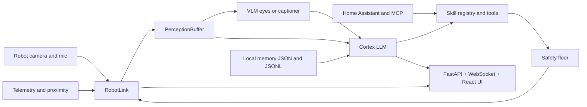
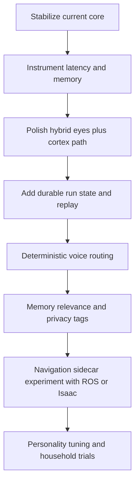

# FreeBo Robot Brain Evaluation Report

## Executive summary

FreeBo is already closer to a **real robot-brain product** than many open-source “agent” repos because it is built around an actual embodied control seam, not just a chat loop. The repository combines a robot-facing transport layer, an event-driven reasoning loop, a mechanical safety floor, local persistent memory, a web UI, and deployment paths for both real hardware and mock development. Its most important architectural decision is the split between **robot control that is never delegated directly to the model** and **LLM cognition that can only act through a closed tool surface guarded by `safety.py` and the `RobotLink` contract**. That is the right core design for a roaming domestic robot. citeturn39view0turn41view0turn5view0turn5view1turn12view0

Against contemporary agent frameworks, FreeBo is unusually strong in **embodiment realism, local-first operation, and mechanical guardrails**, but weaker in **durable orchestration, formal workflow observability, standardized long-running state, and mature robotics middleware integration**. Compared with OpenAI Agents SDK, Anthropic/MCP, LangGraph, LlamaIndex, AutoGPT Platform, ROS 2 with Nav2/MoveIt, NVIDIA Isaac ROS, and Home Assistant Assist, FreeBo’s architecture is best understood as a **lean companion-robot stack**: stronger than general agent frameworks at sensorimotor coupling, but lighter than ROS/Isaac at navigation and lifecycle rigor. citeturn15search0turn15search4turn16search0turn16search5turn17search1turn20search6turn22view0turn23search0turn24search5turn25search19turn26search1

For a single 12 GB GPU, the best path is **not** a monolithic omni model. FreeBo’s own hybrid “reflex + eyes + cortex” direction is the right one. The practical recommendation is: keep the robot-control process lean; run a small **vision model continuously as “eyes”** and a compact **text/tool-using cortex** separately; keep wake word on CPU or satellite hardware; decide deliberately whether STT lives on CPU or GPU; and treat streaming, token budgets, and tool orchestration as first-class performance controls. Official docs across MiniCPM-V, Qwen2.5-VL, Gemma 3, vLLM, llama.cpp, ONNX Runtime, Triton, and faster-whisper all point in that direction: small multimodal models, quantization, paged or hybrid KV/cache management, and separate optimized runtimes per modality are the stable path on constrained hardware. citeturn35search1turn34search0turn34search2turn28search0turn30view0turn27search0turn31search0turn37search1

My overall assessment is that FreeBo should **double down on being an embodied, local-first, companion-agent platform**, not try to become a generic multi-agent workflow builder. The highest-return roadmap is to improve the hybrid brain, latency instrumentation, memory relevance, approval semantics, and robot autonomy stack in measured steps, while borrowing specific ideas from LangGraph, MCP, ROS 2, Isaac ROS, and Home Assistant rather than wholesale replacing the current design. citeturn5view0turn17search1turn16search0turn23search0turn25search0turn26search3

## FreeBo as it exists today

FreeBo presents itself as a **self-hosted, local-first autonomous controller for Enabot EBO robots** with a web UI that shows what the robot is thinking and doing in real time. The README describes the system as one app under `autobot/` that can see, hear, move, speak, emote, and think, using any OpenAI-compatible endpoint for the brain. The repo also makes explicit that the system is intended to run as a single self-hosted application on an ARM Linux box because the native TUTK/Kalay robot libraries are 32-bit ARM/Android binaries. citeturn39view0turn41view0

Architecturally, the repo is cleanly split into a few high-value seams. `autobot/robot/` contains the only robot-facing code; `autobot/brain/` contains the reasoning loop, skills, safety, memory, and provider layer; `autobot/web/` plus `webui/` expose FastAPI, WebSocket streaming, and the dashboard; `collector/` exists to capture credentials and vendor binaries once. The directory tree confirms a substantial brain module, a transport-heavy robot module, and a minimal web layer, which is the right distribution of complexity for this class of system. citeturn39view0turn4view0turn4view1turn4view2

At runtime, FreeBo is explicitly **event-driven rather than fixed-interval polling**. The brain maintains a live `PerceptionBuffer`, refreshes telemetry, frames, captions, and transcripts in background tasks, and feeds a priority event queue into a single reasoner. Speech, commands, and manual input preempt state/touch events, which preempt idle autonomy. That design is materially better than the naive “LLM every N seconds” pattern because it aligns model calls with user salience and interrupts. citeturn5view0turn7view0

The repo documents three brain modes. A **single-model** mode lets one OpenAI-compatible vision model see and decide. A **VLM mode** lets a local vision model both see and choose a primitive motion, bypassing tools and memory. A **hybrid reflex + cortex mode**, which the docs explicitly recommend, uses a dedicated vision service for scene descriptions, a separate OpenAI-compatible model for tool-calling cognition, and a non-LLM reflex stop layer driven by proximity telemetry. That hybrid path is the most architecturally important part of FreeBo because it already encodes the right answer to constrained local robotics: separate fast perception from slower deliberation. citeturn5view0

The **tool surface** is also thoughtfully scoped. FreeBo’s skills expose motion, stopping, camera refresh, speech, eye animation, toggles, docking, memory, recognition, Home Assistant, MCP servers, places, and tasks. Authority is attached per tool, and “owner” tools can be blocked unless the owner is recognized or a dashboard approval window is open. This is more disciplined than exposing arbitrary shell execution or browser automation to the model, and much closer to how embodied agents should be built. citeturn5view0turn10view1

Memory is intentionally plain and inspectable. The repo stores curated long-term memory in `facts.json`, daily append-only notes in `daily/*.jsonl`, and sightings in `sightings.jsonl`, with optional semantic recall through an embedding model when configured. That gives FreeBo continuity across restarts while keeping the data model legible. It is not as sophisticated as a graph memory or vector database, but it is operationally sane and easy to back up, diff, and audit. citeturn5view0turn10view2

The **safety model** is one of FreeBo’s strongest design decisions. Documentation and code agree that every robot-affecting action passes through `safety.py`, which clamps speed, caps duration, rate-limits motion actions, enforces talk and autonomy gates, and fails safe to stop on exceptions. On top of that, `NativeRobotLink` has its own watchdog that sends stop frames if drive frames stop arriving, and the behavior layer forces movement scopes of `roam`, `adjust`, or `hold`. That stack is significantly more mature than “prompt the model to be careful.” citeturn5view1turn8view1turn12view1

The I/O and interface story is coherent. Humans get video through mediamtx via WebRTC or HLS, proxied same-origin by the FastAPI server; the AI gets periodic JPEG snapshots rather than a full video stream; audio in is optional robot microphone data; audio out is TTS rendered to G.711 and forwarded to the speaker. The server owns the `RobotLink` and `AgentBrain`, broadcasts telemetry/thought/action events over WebSocket, exposes emergency stop and calibration APIs, and serves the web UI. That is a very deployable architecture for a home robot. citeturn41view0turn11view0turn13view1

Dependency-wise, the base stack is deliberately small: Python 3.10+, FastAPI, Uvicorn, HTTPX, and optional packages for MQTT, aiortc/PyAV/Numpy/Pillow/Cryptography, faster-whisper, insightface or `face_recognition`, and MCP. The heavy AI stack is explicitly separated in `requirements-ai.txt`, where the repo recommends installing Torch, Transformers, Accelerate, faster-whisper, and a face-recognition backend on a separate GPU machine when desired. That is exactly the kind of separation FreeBo should preserve. citeturn40view0turn6view3

The main technical weaknesses I see are not in the fundamentals but in maturity gaps. In the inspected materials, I did not find durable execution/checkpoint semantics like LangGraph or OpenAI sessions, ROS-native lifecycle/state-machine integration, a formal benchmark harness, or a richer memory retrieval layer than JSON plus optional embeddings. Those are understandable omissions for a lean robot companion stack, but they explain where FreeBo lags contemporary orchestration frameworks and industrial robotics middleware. citeturn15search8turn17search1turn17search14turn20search6turn23search8turn10view2

### FreeBo architecture scorecard

| Dimension | What FreeBo does now | Assessment |
|---|---|---|
| Core architecture | Single app, in-process `RobotLink`, event-driven brain, optional hybrid reflex/eyes/cortex design. citeturn39view0turn41view0turn5view0 | Strong. Sensible for companion robotics and better than a generic chat loop. |
| Model strategy | OpenAI-compatible brain; optional separate vision model; optional VLM service; optional summarizer and embeddings. citeturn5view0turn6view2turn10view0 | Strong direction, especially hybrid mode. |
| Memory | Local JSON/JSONL, optional embedding recall, daily summarization. citeturn10view2turn5view0 | Good for auditability; weaker for scalable retrieval and provenance. |
| Safety | Mechanical clamps, duration caps, action rate limit, talk/autonomy gates, deadman watchdog, reflex stop. citeturn5view1turn8view1turn12view1 | Excellent relative to most agent repos. |
| Interfaces | FastAPI, WebSocket event stream, same-origin video proxy, React dashboard, manual override, onboarding APIs. citeturn11view0turn11view5turn4view2 | Strong operator UX. |
| Deployment | Pi-native ARM path, mock mode on PC, optional remote GPU AI stack. citeturn39view0turn6view1turn6view3 | Strong for hobbyist and home-lab use. |
| Missing maturity | Durable orchestration, quantitative evals, richer navigation stack, ROS/Isaac ecosystem leverage. citeturn17search1turn23search0turn25search19 | Main gap versus modern agent and robotics stacks. |

## Comparison with contemporary projects

The most useful comparison is not “which project is best,” but “which layer of the robot brain each project is strongest at.” FreeBo’s differentiation is that it spans **transport + embodied tool loop + safety + UI** in one repo. The others are usually better than FreeBo at one layer and weaker at the rest. citeturn39view0turn41view0turn15search0turn17search1turn23search0turn25search19

### Comparative matrix

| Project | Architecture | Model stance | Memory / compute footprint | Latency / interactivity | Safety / guardrails | Extensibility | What FreeBo should borrow |
|---|---|---|---|---|---|---|---|
| **FreeBo** | Single-process robot app with transport seam, event queue, skills, memory, safety floor, UI. citeturn39view0turn41view0turn5view0 | Provider-agnostic; hybrid vision+cortex supported. citeturn5view0turn10view0 | Light framework overhead; footprint dominated by chosen models and media processes. citeturn6view1turn40view0 | Good local responsiveness because perception is decoupled from reasoning. citeturn7view0 | Strong mechanical gating. citeturn5view1turn8view1 | Skills + MCP + HA. citeturn5view0turn10view1 | Durable orchestration, richer evals, stronger nav stack. |
| **OpenAI Agents SDK** | Agent + Runner, tools, handoffs, sessions, tracing, HITL, realtime/voice support. citeturn15search0turn15search4turn15search8turn15search11 | Cloud-first OpenAI models; Responses API default. citeturn15search0 | Minimal local compute; model cost/latency externalized to API. | Strong for conversational UX and approvals; weaker for hard real-time robot loops. citeturn15search3turn15search9 | Good logical guardrails and approvals. citeturn15search4turn15search10 | Excellent orchestration and observability. citeturn15search12turn15search14 | Sessions, resumability, tracing, approval state. |
| **Anthropic tool use + MCP** | Tool-use loop plus MCP for external resources, tools, prompts, and remote servers. citeturn16search0turn16search5turn16search10turn16search11 | Claude family, client/server tools, MCP-connected resources. citeturn16search1turn16search5 | Mostly cloud compute. | Good for high-quality tool planning, not a motor-control runtime. | Strong trust messaging around remote MCP servers and approvals. citeturn16search8turn16search21 | Very strong ecosystem interoperability. | FreeBo already exposes MCP; it should deepen MCP policy and auditing. |
| **LangGraph** | Stateful graph runtime with durable execution, persistence, streaming, human-in-the-loop. citeturn17search1turn17search7turn17search14 | Model-agnostic; integrates with LangChain models/tools. | Framework overhead modest; state/checkpoint store adds infra cost. | Excellent for long-running workflows; less tailored to millisecond reflex loops. | Strong because graph transitions and checkpoints are explicit. | Very high. Nodes, edges, state, subgraphs, deployment tooling. citeturn17search2turn17search13 | Explicit state graph and replayable execution. |
| **LlamaIndex** | Event-driven workflows plus `FunctionAgent` and `AgentWorkflow`; context augmentation and data tools. citeturn20search2turn20search3turn20search7turn20search8 | Model-agnostic; strong focus on RAG/data/agent hybrids. | Footprint depends on retrieval stack and model choice; context stores can be heavier than FreeBo’s JSON memory. | Good for data-backed assistants; not specialized for low-latency control. | HITL and state via workflow context. citeturn20search4turn20search6 | High, especially for retrieval and MCP conversion. citeturn20search10turn20search11 | Better retrieval, richer context engineering, workflow context. |
| **AutoGPT Platform** | Server + frontend + low-code workflow builder, marketplace, blocks, continuous agents. citeturn22view0turn21search1 | Many provider backends and marketplace workflows. citeturn22view0 | Heavier app/platform footprint than FreeBo; designed for cloud-style automation. | Good for asynchronous automation, worse fit for tight embodiment. | Platform-level controls exist, but FreeBo’s motor safety is materially stronger for a real robot. | High via blocks and integrations. citeturn22view0 | Builder UX and analytics, not its autonomous loop style. |
| **ROS 2 + Nav2 + MoveIt 2** | Modular node graph, lifecycle nodes, BT-based navigation, manipulation/task constructor. citeturn23search17turn23search8turn23search18turn24search5 | Typically non-LLM-first; perception/planning/control modules chosen separately. | Larger systems overhead, but excellent modularity. | Strong on deterministic robotics latency; conversational capabilities are extra work. | Very strong because lifecycle, BTs, planners, and costmaps are explicit. | Extremely high ecosystem extensibility. | Navigation, localization, lifecycle management, BT/task planning. |
| **NVIDIA Isaac ROS / NIM** | CUDA-accelerated ROS packages, NITROS zero-copy GPU transport, VSLAM, nvblox, Jetson tooling, NIM microservices. citeturn25search19turn25search15turn25search0turn25search12turn25search18turn25search4 | GPU-first robotic AI and microservices. | Higher hardware expectations, especially on Jetson or NVIDIA GPU. | Excellent for real-time GPU perception and mapping. | Strong industrial posture, though broader safety still depends on system integration. | High within NVIDIA/ROS ecosystem. | Zero-copy perception, VSLAM, costmaps, Jetson observability. |
| **Home Assistant Assist** | Voice pipeline with wake word, STT, intent recognition, conversation agent, TTS; fully local option. citeturn26search1turn26search3turn26search4 | Local and cloud conversation agents supported. citeturn26search7 | Can run fully local on home hardware; optimized around Piper/Whisper/Speech-to-Phrase. citeturn26search0 | Strong conversational interactivity in the home, especially for smart-home control. | Strong privacy posture when local; intent pipeline is easier to reason about than open-ended LLM control. | Very high in home-automation domain. | Voice pipeline partitioning, local-first privacy defaults, intent fallback design. |

### What the comparisons mean for FreeBo

Relative to **OpenAI Agents SDK** and **Anthropic/MCP**, FreeBo already has the more appropriate embodiment substrate. Those frameworks are much stronger at **run-state persistence, handoffs, approvals, MCP ergonomics, and tracing**, but they assume a tool-execution environment rather than a mobile robot. FreeBo should copy their **state serialization, approval semantics, and end-to-end audit trails**, not their full runtime model. citeturn15search4turn15search6turn15search8turn15search11turn16search0turn16search11

Relative to **LangGraph** and **LlamaIndex**, FreeBo is simpler and more direct. That is good for a robot. But those systems are materially ahead in explicit workflow/state modeling. FreeBo’s event queue is elegant, yet it is still more implicit than a graph runtime with checkpoints and replay. The highest-value import from these projects is therefore **explicit run state**, **replayable transitions**, and **better context/memory plumbing**, not more abstractions everywhere. citeturn17search1turn17search7turn17search14turn20search6turn20search8

Relative to **AutoGPT Platform**, FreeBo should resist becoming a browser-first low-code automation builder. AutoGPT is designed for continuous workflows, blocks, and marketplaces, not for motion safety and perception-control loops. FreeBo can borrow workflow presentation ideas, but its architectural center of gravity should remain **operator-supervised embodiment**, not unattended cloud automation. citeturn22view0turn21search1

Relative to **ROS 2, Nav2, and MoveIt 2**, FreeBo is much lighter and more approachable, but it is not yet competitive on serious autonomy primitives. If FreeBo ever wants meaningfully better navigation, mapping, place graphs, and task sequencing, the path is not to reinvent that stack inside `agent.py`. It is to either integrate a ROS 2 sidecar or adopt ROS-like concepts: lifecycle states, behavior trees for autonomy, and explicit local planners/costmaps. citeturn23search0turn23search8turn23search18turn24search5turn24search9

Relative to **NVIDIA Isaac ROS**, FreeBo’s weakness is high-performance perception plumbing. Isaac ROS gives GPU-native VSLAM, nvblox costmaps, and NITROS zero-copy transport. FreeBo’s current snapshot-based LLM perception is simpler and often appropriate, but any serious upgrade in local navigation quality will eventually benefit from importing Isaac or ROS perception components below the LLM layer. citeturn25search0turn25search12turn25search18turn25search20

Relative to **Home Assistant Assist**, FreeBo should borrow more than it already does. Assist’s wake word → STT → intent/conversation → TTS pipeline is exactly the sort of modular voice architecture that sits well inside a home robot. FreeBo already integrates Home Assistant tools; the next leap is to adopt Assist-like **pipeline partitioning, local privacy defaults, and deterministic smart-home intent fallbacks** before open-ended LLM responses. citeturn26search1turn26search3turn26search4turn26search7

## A practical 12 GB GPU design for FreeBo

The highest-confidence recommendation is to make FreeBo’s **hybrid mode the default architecture** for serious local deployments. A 12 GB GPU is enough for a compelling home robot, but not enough to casually run a large omni model, a large VLM, GPU STT, TTS, and long-context tool use without careful contention management. The repo’s own hybrid description already points to the right decomposition: a low-latency visual “eyes” component, a compact text/tool cortex, and a non-LLM reflex layer. citeturn5view0turn6view3

### Recommended model patterns

| Pattern | Recommended use | Example stack | Why it fits 12 GB |
|---|---|---|---|
| **Best overall** | A live home assistant robot that must move, talk, and stay responsive | **MiniCPM-V 4.6** as “eyes” plus a compact text cortex such as **MiniCPM5-1B** or another small instruct/tool model, with **faster-whisper** and **Piper** separated by policy. MiniCPM-V 4.6 officially advertises 4 GB GPU memory, 3 GB in BNB int4, and a 2 GB GGUF option; MiniCPM5-1B is positioned for local assistants and tool-use workflows. citeturn35search1turn35search0turn37search1turn36search0 | Leaves headroom for KV cache and occasional GPU STT; easiest to keep interactive. |
| **Best single-model baseline** | Simpler deployment when you can tolerate higher contention | **Qwen2.5-VL-3B-Instruct** or **Gemma 3 4B** as a single multimodal model. Qwen2.5-VL’s official card emphasizes agentic behavior, visual localization, and stable JSON outputs; Gemma 3 4B is explicitly described as suitable for limited-resource deployments. citeturn34search0turn34search6turn34search9turn34search2 | Works on 12 GB in 4-bit/AWQ-style setups, but concurrency will be tighter. |
| **Best for CPU+GPU hybrid simplicity** | Local OpenAI-compatible serving with minimum ops overhead | **GGUF model in llama.cpp** for text cortex, possibly with a separate tiny VLM service. llama.cpp emphasizes integer quantization, hybrid CPU+GPU inference, and an OpenAI-compatible server. citeturn30view0turn29search0turn30view1 | Very forgiving when VRAM is tight; ideal for one-bot serving. |
| **Best for throughput and multiple clients** | If FreeBo shares a GPU server with other services or bots | **vLLM** serving the cortex and possibly a supported multimodal model. vLLM documents PagedAttention, continuous batching, prefix caching, quantization, and chunked prefill. citeturn28search0turn28search1turn28search6 | Better serving efficiency, but operationally heavier than llama.cpp. |

In practical terms, I would rank the 12 GB options like this. For the **most robust FreeBo deployment**, use **hybrid mode with a small VLM and a separate text cortex**. For the **simplest local baseline**, use a single **Qwen2.5-VL-3B** or **Gemma 3 4B** checkpoint. Reserve large single-model omni experiments for later, because the complexity budget is better spent on latency control and tool-quality than on forcing every modality into one checkpoint. citeturn5view0turn35search1turn34search0turn34search2

### Memory and latency strategy

On 12 GB, the main enemy is not only model weights; it is also **KV cache growth, overlapping modality workloads, and concurrency spikes**. vLLM’s PagedAttention and continuous batching exist precisely because KV memory management dominates production inference efficiency, while llama.cpp explicitly supports **CPU+GPU hybrid inference** and quantized GGUF models when the full checkpoint does not fit in VRAM. That means FreeBo should expose **context ceilings, model-role separation, and cache-aware policies** in config, rather than pretending “the GPU will sort it out.” citeturn28search0turn28search6turn30view0

My concrete recommendations are these. Keep the **cortex context short** by default: roughly **2k–4k tokens live prompt budget** for robot control, with long-term memory summarized down aggressively and only task-relevant facts injected. Keep image captions concise; FreeBo’s own VISION_PROMPT is already terse and navigation-oriented, which is good. Use **streaming first-token output** and do not wait for full fluent prose before allowing tool calls. Limit each reason cycle to a small number of tool rounds; FreeBo already caps this at `MAX_TOOL_ROUNDS = 3`, which is a good default for a moving platform. citeturn7view0turn10view2

For quantization, the order of preference on a single 12 GB GPU is: **weight quantization first**, then **CPU offload**, then **more aggressive model downsizing**, and only then heavier batching. Official docs support all the needed building blocks: vLLM supports AWQ, GPTQ, INT4, INT8, FP8 and more; llama.cpp supports broad integer quantization and hybrid CPU+GPU inference; faster-whisper improves memory use further with 8-bit compute; MiniCPM-V provides explicit 3 GB and 4 GB deployment variants. citeturn28search0turn28search1turn30view0turn37search1turn35search1

For STT, there is a real trade-off. `faster-whisper` publishes concrete GPU numbers showing that it can run **large-v2 int8** at about **2926 MB VRAM** and **59 seconds for 13 minutes of audio** on an RTX 3070 Ti 8 GB, and an even faster batched mode at higher VRAM. That means GPU STT is feasible on a 12 GB card, but it will compete directly with the cortex or VLM. My recommendation is therefore: keep STT on **CPU or a small GPU slice by default**, and only move STT to GPU if your text+vision stack stays comfortably under budget. citeturn37search1

For wake word, use **openWakeWord** or a satellite/microcontroller path rather than paying GPU tax. openWakeWord supports ONNX Runtime and TFLite, recommends 80 ms frames, and explicitly targets voice interfaces with relatively modest compute. That is a better fit for always-on home listening than running an LLM or Whisper loop continuously. citeturn38search0

### Runtime and deployment recommendations

For FreeBo specifically, I recommend a **two-tier deployment pattern** as the default production architecture:

| Layer | Recommended runtime | Why |
|---|---|---|
| Robot control plane | FreeBo core app on the Pi or robot-adjacent box | Matches the repo’s native assumptions and keeps safety, transport, and UI close to the robot. citeturn39view0turn41view0turn6view1 |
| Cortex inference | **vLLM** if you need an OpenAI-compatible server with efficient batching and KV management; **llama.cpp** if you want the simplest single-bot serving with GGUF and CPU+GPU hybrid inference. citeturn28search0turn30view0 | Best trade-off between simplicity and serving efficiency. |
| Vision “eyes” | **Transformers + Torch** for MiniCPM-V / Qwen-VL style models; **ONNX Runtime** when you have an exportable vision or face model and want CUDA/TensorRT execution providers. citeturn6view3turn27search0turn27search8 | FreeBo already assumes a separate VLM service is acceptable. |
| STT | **faster-whisper** via CTranslate2. citeturn37search1 | Good latency/memory trade-off and clear CUDA/cuDNN guidance. |
| TTS | **Piper** if you want local neural voice; keep OS TTS fallback. FreeBo already supports both. citeturn13view1turn36search0 | Reduces cloud dependence and preserves local-first behavior. |
| Multi-model serving | **Triton** only when you truly need ensembles, concurrent execution, or shared hosting across multiple models/services. Triton officially supports dynamic batching, concurrent execution, ensembles, and streaming workloads. citeturn31search0 | Powerful, but overkill for a single robot unless you consolidate services. |
| Large multi-GPU serving | **DeepSpeed** or **FasterTransformer** only if FreeBo grows into a larger model-serving environment. DeepSpeed focuses on model parallelism, inference kernels, and quantization; FasterTransformer is a highly optimized transformer inference library. citeturn32search4turn32search0turn31search4 | Not the first choice for one 12 GB card. |

For software versions, the safest current recommendation is to align around a **modern CUDA 12.x toolchain** and avoid version mismatches. PyTorch’s official install matrix currently exposes stable builds for **CUDA 12.6** and newer; ONNX Runtime’s CUDA EP is built and tested with **CUDA 12.x and cuDNN 9**; and faster-whisper’s current guidance also targets **CUDA 12 + cuDNN 9** via CTranslate2. That makes **PyTorch stable with CUDA 12.6** plus **cuDNN 9-compatible auxiliary runtimes** the cleanest general baseline for a Linux GPU box. citeturn33search0turn27search6turn37search1

The operational implication is simple: if you want the least pain, keep the robot app itself lightweight and containerized, and put the GPU inference services on a separate Linux box using Docker Compose or equivalent. FreeBo’s own `requirements-ai.txt` is already written for exactly that split. citeturn6view3turn39view0

## Interaction design for a playful, annoying, useful home robot

FreeBo’s default persona already points toward a “friendly dog / inquisitive kid / Jarvis” blend. That is directionally correct, but a rolling home assistant needs a more explicit **interaction contract** so that “playful and annoying” stays charming rather than exhausting. The system should behave like a companion that is socially persistent but operationally interruptible: short lines, frequent acknowledgments, visible state, and clear obedience boundaries. FreeBo already has the building blocks for name gating, owner gating, quiet windows, sleep, approval windows, and eye expressions. The design task is to turn those primitives into a consistent character policy. citeturn9view0turn5view0turn8view1

I would implement the personality in three bands. In the **default band**, the robot makes short observational comments, gently suggests useful actions, and uses eyes and short speech rather than long monologues. In the **nudge band**, it becomes deliberately a little annoying but task-shaped: “You’ve left the kitchen lights on again,” “That laundry basket still exists,” “I saw your charger under the sofa.” In the **hard-stop band**, it becomes all business: obstacle alerts, privacy mode, approval requests, battery docking, or “I’m not doing that until Ben approves.” That separation lets the robot be expressive without polluting safety-critical moments. FreeBo’s current tool/authority/safety primitives fit this pattern well. citeturn5view0turn5view1

For multimodal I/O, the best pattern is **eyes first, speech second, dashboard always**. The eye animations should carry most low-stakes state transitions: curious, surprised, listening, processing, denied, docked, sleepy. Speech should stay brief and noticeably more sparse than a voice-only assistant. The dashboard should remain the full-fidelity truth source, with live thoughts/actions, memory, tasks, approvals, and privacy state. That matches how FreeBo already streams AI thoughts and actions to the UI. citeturn39view0turn11view0

On privacy, the robot should be **local first by default and explicit when it isn’t**. Home Assistant’s Assist is instructive here: it emphasizes that a fully local setup keeps spoken commands in the home and clearly defines the pipeline stages. FreeBo should adopt the same user promise and visibly expose which stages are local and which are remote on every active pipeline. If the cortex is remote, say so in the UI. If the mic is disabled, show it. If the robot is asleep or in owner-only mode, make that visually obvious. citeturn26search0turn26search1turn26search3

For local-first storage, keep the current JSON/JSONL memory model, but add two safeguards. First, tag every stored memory with **source, confidence, and privacy scope**. Second, separate **ephemeral interaction buffer** from **durable memory worthy of recall**. FreeBo already distinguishes long-term facts from daily notes and sightings; extending that with privacy/classification metadata would materially improve trust without requiring a heavy database. citeturn10view2

The voice pipeline should be deterministic when it can be. Home Assistant’s pipeline design is a strong template: wake word, STT, intent/conversation, TTS. For FreeBo, that means person- and context-aware routing. “Turn on the hallway light” should go through deterministic Home Assistant tooling when possible. “Where did I leave my keys?” should invoke memory and camera reasoning. “Come here” should be a tightly bounded robot command path. That routing discipline is how you make the robot feel useful instead of theatrically random. citeturn26search1turn26search4turn5view0

## Prioritized roadmap, experiments, and metrics

The roadmap should emphasize **measurable reliability gains before capability expansion**. FreeBo’s architecture is already good enough that chasing more models before adding benchmark discipline would be a mistake. The next six to eight experiments should therefore be about latency, memory pressure, voice quality, navigation confidence, and operator trust. That ordering follows directly from the repo’s current strengths and weaknesses. citeturn5view0turn10view2turn11view0

### Recommended experiment backlog

| Priority | Experiment | What to measure | Success condition |
|---|---|---|---|
| Highest | Make **hybrid mode** the default polished path | Control-loop p50/p95 latency, first-token latency, tool-call latency, GPU utilization, perceived responsiveness | Hybrid mode clearly beats single-model mode on responsiveness and stability. |
| Highest | Add a **benchmark harness** around `tick`, voice, caption, and tool cycles | End-to-end turn latency, per-stage latency, failure rate, dropped frames, motion stop latency | Every release can be compared on identical traces. |
| Highest | Add **durable run-state / replay** | Ability to reconstruct a turn, approvals, interrupts, and tool path after the fact | Robot actions become auditable and debuggable. |
| High | Add **deterministic voice routing** for HA intents versus open LLM turns | Intent success rate, accidental open-ended routing rate, task completion time | Home-control commands become faster and more reliable. |
| High | Improve **memory relevance** | Recall precision@k, duplicate memory rate, stale-memory rate | Robot recalls the right facts more often without memory bloat. |
| High | Add richer **navigation supervision** | Patrol coverage, repeated-path rate, obstacle intervention rate, docking success rate | Robot roams less repetitively and docks more reliably. |
| Medium | Add **ROS 2 or Isaac-sidecar prototype** | VSLAM quality, place accuracy, CPU/GPU overhead, integration complexity | Decide whether deeper robotics middleware adoption is worth it. |
| Medium | Build **personality policy layer** separate from core prompts | User annoyance score, interruption rate, acceptance of nudges, talk frequency | Personality becomes tunable instead of prompt-fragile. |

### Metrics that matter

The most important latency metric is not raw token/s; it is **time from user signal to robot action**. Track at least these p50/p95/p99 metrics: wake word to STT finalization, STT finalization to first token, first token to first tool call, tool call to motor command, obstacle event to stop, and camera frame age at decision time. Those metrics will tell you whether the system feels alive. citeturn7view0turn5view0

The most important memory metrics are **recall precision**, **memory growth**, and **contradiction rate**. Track how often the robot recalls the correct owner preference or place, how many memories are duplicated or stale, and how often a recalled fact is contradicted by a newer observation. FreeBo’s current file-based memory makes these metrics straightforward to compute. citeturn10view2

The most important safety metrics are **forbidden-action block rate**, **false approvals required**, **false motion attempts**, **recovery after provider failure**, and **obstacle-stop latency**. Because FreeBo already has a strong safety floor, these should become visible release gates. citeturn5view1turn8view1turn12view1

The most important UX metrics are **speech frequency**, **user interruption frequency**, **owner approval burden**, **task completion rate**, and a simple weekly **“useful vs annoying” score** from household users. A playful home robot does not win by sounding brilliant; it wins by being invited to stay powered on. That metric should be treated as seriously as latency. 

## Final recommendations

FreeBo should keep its current identity: **a local-first, embodied, operator-visible robot brain with hard safety constraints**. That is a strong strategic position, and the repo already expresses it unusually well for an early-stage project. citeturn39view0turn5view0turn5view1

The highest-value software changes are these. First, make **hybrid mode** the polished “golden path.” Second, add **state serialization and replay** inspired by LangGraph or OpenAI sessions. Third, add a **benchmark harness** that captures turn latency, tool latency, memory quality, and safety events. Fourth, adopt **Home Assistant-style deterministic voice pipelines** for command-and-control tasks. Fifth, begin a limited **ROS 2 / Isaac sidecar** experiment only after you have baseline metrics in place. citeturn17search1turn15search8turn26search1turn23search0turn25search0

For a single 12 GB GPU, the recommended production shape is: **FreeBo core on the robot-side system**, **a small VLM “eyes” service**, **a compact text cortex behind vLLM or llama.cpp**, **faster-whisper for STT**, **Piper for local TTS**, and **wake word outside the main GPU path**. Use **CUDA 12.6-class PyTorch** on the model box, keep **ONNX Runtime on CUDA 12.x + cuDNN 9** when exporting smaller models is advantageous, and reserve Triton, DeepSpeed, and FasterTransformer for future multi-model or multi-GPU scaling phases rather than the first serious deployment. citeturn33search0turn27search6turn37search1turn28search0turn30view0turn31search0turn32search4turn31search4

If the product vision is “playful, annoying, but useful rolling home assistant,” then the decisive design principle is this: **a robot should be socially expressive but behaviorally boring**. FreeBo already has the core of that philosophy in its safety floor, owner gating, sleep/quiet controls, and local inspectable memory. The roadmap should make those strengths more measurable, more replayable, and more responsive rather than replacing them with a more abstract agent stack. citeturn5view0turn5view1turn10view2

## Open questions and limitations

This report is based on the repository materials and official project documentation I could inspect directly, not on a live benchmark run of FreeBo on your target hardware. I therefore did **not** measure real latency, VRAM usage, navigation performance, or speech quality on an actual EBO deployment. Those should be treated as the next validation step, not assumed solved. citeturn39view0turn6view3turn37search1

I also did not inspect every file in the repo, especially the full web UI and all native-link implementation details. The architectural conclusions are therefore strongest on the inspected core documents and control-path files: README, architecture, safety, brain docs, config, memory, provider client, link contract, native link summary, and server layer. citeturn39view0turn41view0turn5view0turn5view1turn10view2turn10view0turn12view0turn12view1turn11view0