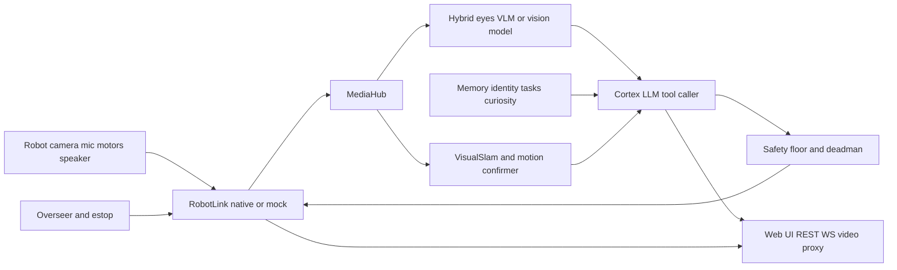
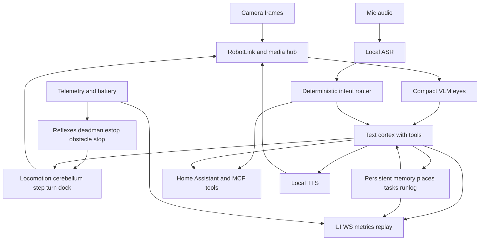
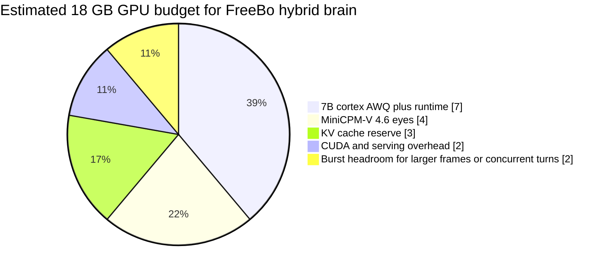

# FreeBo Robot Brain Evaluation and Design Recommendations

## Executive summary

FreeBo already has the outline of a credible embodied-agent architecture. The strongest parts are not the language model choice; they are the **operator-visible control loop**, the **closed tool surface**, the **mechanical safety floor**, the **event-driven brain**, the **local-first deployment story**, and the fact that the repo already separates fast reflexes from slower reasoning in several places. In the public repo snapshot I inspected, FreeBo exposes robot control through a `RobotLink`, runs an event-driven `AgentBrain`, supports single-model, VLM-only, hybrid, and omni modes, keeps persistent memory on disk, attaches a lightweight visual odometry consumer, streams thoughts/actions to the UI, and ships self-tests, metrics, and CI. Those are all signs of a design that is aiming at robustness rather than just “LLM demo magic.” citeturn1view0turn6view0turn4view1turn11view0turn16view1turn16view3

The main architectural conclusion is this: **for a single GPU around 18 GB VRAM, with 24 GB as a hard ceiling, FreeBo should standardize on a hybrid brain** rather than a monolithic omni model. The repo itself already documents hybrid as the recommended “reflex + eyes + cortex” path, and that matches what current open model ecosystems support best: a small vision model for scene understanding, a separate compact text/tool-calling cortex, CPU- or light-GPU ASR, and lightweight local TTS. That modular arrangement is easier to debug, easier to keep responsive, and much safer to bound than an end-to-end streaming omni stack on consumer hardware. citeturn6view0turn15view0turn19search0turn19search9turn29view1turn29view2

Against modern open robotics projects, FreeBo is **already ahead** on “personality + local UI + embodied tool-using agent” and **behind** on “metric navigation + mature localization + planner/controller stack.” ROS 2 Nav2, RTAB-Map, Cartographer, and ORB-SLAM3 are much stronger for explicit mapping, localization, route planning, and long-horizon navigation, but they also assume materially better sensing and more traditional robotics integration. FreeBo’s own navigation docs are admirably honest: on monocular EBO hardware, it does **not** claim true metric SLAM or global path planning, and instead uses named places, visual recognition, bounded VSLAM, calibration, curiosity nudges, and safety-clamped steps. That honesty is a strength; the mistake would be pretending the current hardware can do more than it can. citeturn32view0turn32view1turn32view2turn25search0turn16view0turn28view0

The best way to make FreeBo “a brilliant little ball of fun/annoyance” while still remaining practical is to treat it as a **layered home companion robot**, not as a tiny general autonomy stack. That means: deterministic reflexes and motion primitives at the bottom; event-driven perception and tool use in the middle; expressive dialogue, memory, and personality at the top; and a separate topological navigation layer instead of a premature full metric planner. Add a deterministic Home Assistant voice/intent layer ahead of the LLM, keep ASR/TTS local, make run logging and replay first-class, and only introduce ROS 2 sidecars if sensor quality or platform ambitions outgrow the current direct architecture. citeturn28view0turn32view4turn26search3turn15view0turn27search3

I did **not** have runtime logs, profiler traces, calibration captures, or hardware telemetry dumps from your specific deployment. The report is therefore grounded in the public repository files and official upstream documentation; wherever concrete real-world latency or hardware behavior would materially change a recommendation, I mark it as an estimate or as an unspecified constraint.

## What FreeBo is today

At a system level, FreeBo is not just “an LLM attached to a robot.” The repo describes a single user-facing application that owns robot I/O, the AI loop, a web server, and the UI, with only unavoidable native subprocesses for the robot link and media handling. The public README says the stack can run on a Raspberry Pi because the robot-native protocol libraries are ARM/Android-only, while the docs and optional AI requirements also describe a **hybrid deployment** where heavy AI services run on a separate GPU machine over HTTP. That is an important design clue: conceptually the project started as a single-box stack, but it is already evolving toward **split deployment for heavy perception/reasoning**, which is exactly the right direction for an 18 GB GPU brain. citeturn1view0turn2view0turn5view1

The brain implementation is stronger than a basic tick loop. The checked-in AI docs describe an **event-driven** reasoner with a live perception buffer, priority queueing for speech/manual/state/idle events, optional hybrid VLM perception, an optional omni path, persistent memory, identity/owner gating, task scheduling, curiosity, and high-priority command handling. The raw `agent.py` header reinforces that design: perception is continuous, motion is non-blocking, captioning is decoupled from decisions, and any error is fail-safe to stop rather than continue driving. This architecture is much closer to modern code-owned agent orchestration than to toy autonomous-agent loops. citeturn6view0turn5view3

FreeBo’s safety story is one of its best features. The repo documents a formal **safety floor** in `safety.py` that clamps speed, caps move duration, rate-limits motion actions, gates talkback, blocks AI motion in manual mode, and forces stop on exceptions. On top of that it has a two-layer deadman, a non-LLM obstacle reflex, an emergency-stop endpoint that bypasses the agent loop, and a stronger “sleep/go dark” mode that cuts reasoning, media, STT, captioning, SLAM, and manual actuation while keeping the session warm enough to wake quickly. That independence between fast safety layers and slower AI is the correct pattern for any moving robot. citeturn4view1turn3view3

The motion subsystem is also more sophisticated than a naive “LLM outputs joystick vectors” design. The motion docs explicitly say the brain should never emit raw wheel magnitudes directly; it should express **intents**, and lower layers handle deadband-aware motor control and confirmation. The repo documents a layered “nervous system” consisting of visual motion sensing, reflex stop logic, a locomotion or “cerebellum” layer, the safety floor, advisory SLAM, and a reasoning cortex. It also includes a calibration profile that measures the smallest bursts that produce reliable visual change, so autonomous movement becomes a series of small observed steps rather than long blind lunges. That is exactly the right instinct for weakly sensed diff-drive indoor robots. citeturn28view0turn28view1turn12view1

Navigation, however, remains the biggest limitation. FreeBo’s own navigation docs are explicit that EBO hardware is monocular, lacks the sensor quality needed for true metric SLAM from FreeBo’s side, and therefore does not support a real floor-plan map or global path planning. Instead, it offers named places, visual place recognition, a topological place graph, coarse VSLAM coverage, native avoidance toggles, reflex stop behavior, and pre-flight movement calibration. In practice, that means FreeBo today is closer to a **companion rover with bounded topological memory** than to a household mobile robot doing precise autonomous navigation. This is not a flaw; it is simply the current sensor envelope. citeturn16view0turn12view0

The repo already has unusually good measurement and test hooks for such an early project. The server exposes metrics for latency phases such as `perceive`, `provider`, `tool`, `reason`, `vlm_perceive`, `caption`, `vlm_decide`, `omni`, and `reflex_stop`. The docs describe a live capability self-test that exercises connection, video, eyes, move, rotate, talk, hear, autonomy, and VSLAM, as well as a mock-based pytest suite. CI currently runs Python 3.10 and 3.11, installs ffmpeg, checks protocol byte identity, and runs the test suite. That gives you a much better foundation for iterative improvement than most hobby robotics repos have. citeturn11view0turn15view0turn16view1turn16view3

There are also clear signs that the repo is still in architectural transition. The README leads with EBO SE and a Pi-first story; setup docs and motion/navigation docs spend substantial time on Air 2 and a native cloud path; the server already includes an overseer/puppet mode and a VSLAM provider; the maturity guide says durable run-state/replay is still TODO; and it explicitly leaves a ROS 2/Isaac sidecar as deferred future work. I would treat FreeBo as a **promising but still crystallizing architecture**, not as a settled platform. citeturn1view0turn4view2turn28view0turn15view0

The diagram below summarizes the current architectural shape as reconstructed from the repo.

That diagram is derived from the repo’s architecture docs, AI brain docs, server, SLAM, and motion documentation. citeturn2view0turn6view0turn10view0turn12view0turn28view0

## How FreeBo compares with modern projects

FreeBo sits in an unusual middle ground. It is much more **agentic and interactive** than mainstream ROS navigation stacks, but much less mature on localization and route planning. Compared with modern open agent frameworks, it is refreshingly embodied and safety-conscious. Compared with research-grade vision-language-action systems, it is more practical for a home companion robot because it already has operator controls, memory, UI, and fail-safes. The table below captures the most relevant comparisons.

| Stack or project family | What it is strongest at | What it does better than FreeBo today | Why you should not copy it wholesale |
|---|---|---|---|
| **FreeBo as designed** | Embodied local-first companion robot with visible reasoning, tools, safety gates, memory, and web UI. citeturn1view0turn6view0turn4view1 | Strong operator visibility, direct robot integration, lightweight deployment, rich interaction surface. citeturn1view0turn10view0 | Weak on metric localization, global planning, and long-horizon autonomy because the hardware and current stack are monocular/topological. citeturn16view0turn12view0 |
| **ROS 2 Nav2** | Production-grade mobile robot navigation with localization, obstacle avoidance, planning, and behavior trees. citeturn32view0 | Real navigation stack: planner, controller, costmaps, recovery behaviors, route computation. citeturn32view0 | Heavy integration tax; assumes better sensing and a ROS-centric architecture. For current EBO-class monocular hardware, it would likely be more scaffolding than value. |
| **RTAB-Map** | Graph-based visual/LiDAR SLAM with loop closure and memory-managed large-scale operation. citeturn32view1 | Stronger loop closure, map optimization, re-localization, and multi-session mapping than FreeBo’s advisory VSLAM. citeturn32view1 | Best with RGB-D, stereo, or LiDAR. FreeBo’s own docs explicitly argue current monocular stream quality is not a good fit for robust full SLAM. citeturn16view0 |
| **Cartographer** | Real-time 2D/3D SLAM in a standalone C++ library with ROS integration. citeturn32view2turn25search9 | Mature pose graph SLAM and mapping foundations. citeturn32view2 | Same issue as above: great when you have the right sensors; not the first place to spend effort on a monocular home companion bot. |
| **ORB-SLAM3** | Accurate visual/visual-inertial/multi-map SLAM with monocular, stereo, RGB-D, and fisheye support. citeturn25search0turn25search1 | Considerably stronger visual(-inertial) SLAM theory and practice than FreeBo’s lightweight bounded VO. citeturn25search0turn25search1 | Needs camera calibration, stable feed quality, and more careful robotics infrastructure. FreeBo’s own docs correctly call this fragile on current Pi + P2P stream constraints. citeturn16view0 |
| **openpilot-style architecture** | Safety-critical separation of perception, control, and independent supervision/monitoring. citeturn32view3 | Better template for “AI is advisory, low-level safety remains sovereign.” The driver-monitoring analogy is useful for human-override and supervision design. citeturn32view3 | Domain mismatch: driving stack, richer sensors, very different dynamics. Borrow patterns, not code. |
| **OpenAI Agents SDK and Anthropic tool-use patterns** | Application-owned orchestration, tool execution, approvals, tracing, and state. citeturn19search0turn19search9turn19search16 | These patterns validate FreeBo’s core direction: keep tools and approvals in code, not only in prompts. Anthropic’s MCP and advisor concepts are also strong references for external-tool integration and cheap-executor-plus-strong-advisor designs. citeturn19search3turn19search17 | They are not robotics frameworks. You still need motion primitives, watchdogs, localization, and hardware supervision. |
| **BabyAGI-style loops** | Autonomous task generation and memory-centric planning experiments. citeturn31view2 | Useful as cautionary inspiration for long-horizon memory/task patterns. | The project explicitly says it is experimental and not meant for production use. It is the wrong core architecture for a moving household robot. citeturn31view2 |
| **OpenVLA and LeRobot** | Learning-based robotic policies, VLA research, dataset collection, fine-tuning, and deployment interfaces. citeturn31view0turn31view1 | Better for training or fine-tuning action policies on well-defined embodiments; LeRobot also offers a strong hardware abstraction and dataset stack. citeturn31view0turn31view1 | Geared mainly toward manipulation and policy learning, not turnkey rolling-home-assistant behavior. For FreeBo, they are side inspirations, not the primary architecture. |

The most important strategic takeaway from that comparison is that **FreeBo should compete on being a delightful, inspectable, local embodied assistant**, not on pretending to be a full ROS navigation stack or a pure VLA policy learner. If you add too much classical robotics too early, you will slow down the fun, interactive, home-assistant experience that is actually differentiated here. If you add too much “agentic autonomy” without deterministic control layers, you will make it charming but unreliable. The right answer is a layered hybrid. citeturn1view0turn6view0turn32view0turn19search0

## The architecture I would actually target on an 18 GB GPU

The repo’s own maturity guide already points in the right direction by elevating **hybrid** as the golden path. I agree with that strongly. For FreeBo, “smart and interactive” does **not** require a one-model omni brain; it requires the correct separation of responsibilities. In a home robot, the most important design decision is not “which biggest model fits?” but “which loops must keep working even if the model stalls?” FreeBo already has good foundations for that question. citeturn15view0turn4view1turn28view0

The target brain should have five layers:

1. **Link and media layer** on the robot-side box or host CPU: robot protocol, camera/audio ingest, manual control, e-stop, media fan-out.  
2. **Reflex and motion-control layer** on CPU: deadman, obstacle stop, calibration-aware step/turn primitives, motion confirmation, docking routines.  
3. **Perception layer** on GPU: one compact VLM that converts sparse frames into scene summaries, object/person cues, rough path descriptions, and maybe visual place-recognition embeddings.  
4. **Cortex layer** on GPU: a compact text/tool-calling model that handles dialogue, Home Assistant tools, memory queries, place selection, and task planning.  
5. **Voice/memory layer** mostly on CPU: wake/VAD, ASR, TTS, deterministic intent router, summarized/persistent memory, and replay logs. citeturn6view0turn28view0turn32view4turn19search0turn19search9

That gives you a proposed “real brain” like this:

That proposed architecture is consistent with FreeBo’s existing hybrid brain documentation, its safety design, Home Assistant’s staged voice pipeline, and modern code-owned agent/tool orchestration patterns. citeturn6view0turn4view1turn32view4turn19search0turn19search9

### Recommended model stack

The practical model choices come down to what you want to optimize: control reliability, conversational charm, or maximum local multimodality. On your budget, I would not optimize for “single model purity.” I would optimize for **predictable interaction latency** and **bounded VRAM usage**.

| Role | Primary recommendation | Why | Notes for FreeBo |
|---|---|---|---|
| **Eyes VLM** | **MiniCPM-V 4.6**. Officially positioned as edge-deployment-friendly, with mixed visual token compression and support across Transformers, vLLM, SGLang, llama.cpp, and Ollama. citeturn29view0turn30view2turn27search1turn27search4 | Strong efficiency profile for sparse frame understanding; better fit than a giant vision model for “tell the cortex what the robot sees.” | Best default for hybrid path. Use only sparse JPEGs or low-FPS frame samples. FreeBo already supports a separate VLM “eyes” service. citeturn9view0turn6view0 |
| **Eyes VLM fallback for 12 GB or very conservative budgets** | **Qwen2.5-VL-3B-Instruct-AWQ** or **SmolVLM2-2.2B**. Qwen2.5-VL is explicitly agentic and supports stable JSON-like coordinate/attribute outputs; SmolVLM2-2.2B officially reports 5.2 GB GPU RAM for video inference. citeturn24search1turn24search5turn29view3 | Qwen is better for structured outputs and tool-friendly perception; SmolVLM2 is the safest tiny choice. | If you want “eyes that sometimes output path/object structure,” choose Qwen; if you want maximum memory headroom, choose SmolVLM2. |
| **Cortex text model** | **Qwen2.5-7B-Instruct-AWQ** served with vLLM or SGLang. Qwen2.5 has open 7B instruct weights; vLLM and SGLang both support OpenAI-compatible serving and aggressive inference optimizations. citeturn21search5turn24search15turn27search1turn27search4 | Good quality/VRAM compromise for tool use, dialogue, and memory reasoning. | Keep this non-vision if hybrid eyes are active; that preserves headroom and lets you switch the eyes independently. |
| **Cortex fallback** | **Qwen2.5-3B-Instruct-AWQ**. citeturn21search11turn24search14 | Fits weaker GPUs and keeps latency down. | Use only if you need 12 GB-class total fit or very low power draw. |
| **ASR** | **faster-whisper**. It is explicitly benchmarked by its maintainers as faster and lower-memory than reference Whisper implementations, with optional 8-bit quantization. citeturn29view4 | Mature, practical, easy to run on CPU or light GPU. | For a home robot, CPU ASR is often good enough if utterances are short and you use VAD and intent routing. |
| **TTS** | **Piper** for zero-drama offline use; **Kokoro** if you want more personality and can tolerate a somewhat richer stack; **CosyVoice** only if you decide to optimize for streaming voice performance later. Piper is fast/local; Kokoro is 82M and Apache-licensed; CosyVoice emphasizes bi-streaming and ~150 ms first-packet latency. citeturn17view0turn17view1turn23search1turn29view5turn23search3turn23search7 | TTS is a major part of “fun/annoyance,” but it should not be allowed to dominate GPU budget. | My advice: start with Piper or Kokoro on CPU. Only bring in CosyVoice if you later decide streamed speech is a product requirement. |
| **Omni one-model experiment** | **MiniCPM-o 4.5** or **2.6** only as an experimental branch. Official cards highlight full-duplex multimodal streaming and local deployment support. citeturn29view1turn29view2 | Impressive capabilities, but operationally riskier under a hard 18–24 GB cap. | Keep it as an optional branch, not the default brain. |

The reason I do **not** recommend an omni model as the default is straightforward: a single rolling home assistant needs **steady control quality** more than it needs architectural purity. MiniCPM-o is impressive and open, but in practice omni models combine the worst memory pressure from visual tokens, audio state, generation state, and streaming interactions. For a home robot that must also keep reflexes, motion confirmation, and UI telemetry working, the modular stack is safer and easier to profile. citeturn29view1turn29view2turn22search0turn27search1

### Recommended software architecture changes

The code changes I would prioritize are these.

First, **make hybrid the canonical production path** in both code and UI. The repo already says this in its maturity guide, but the implementation should become clearer in config, setup, and documentation: “eyes” can restart independently; “cortex” can fall back if eyes are down; the UI should show current brain mode, VLM health, and whether the cortex is text-only or vision-capable. That separation is already outlined in the maturity guide and should be carried all the way through the user experience. citeturn15view0turn6view0

Second, **promote motion to an explicit contract of intents, not raw drive vectors**. The motion docs already say the brain should not emit raw `ly/rx` magnitudes and should go through locomotion. Treat that as inviolable. Make the cortex output only verbs like `step_forward`, `turn_left_small`, `turn_right_medium`, `look_left`, `dock`, `back_off`, `follow_person`, and `go_to_place`. This shrinks the action space, improves repeatability, and makes replay/testing dramatically easier. citeturn28view0turn28view1

Third, **drop the idea of metric autonomy as a near-term objective** unless you change the sensing stack. The right near-term navigation abstraction is **topological**: saved places, graph edges, visual re-identification, doorway detection, room labels, and a patrol scheduler that chooses the next adjacent place rather than repeatedly asking the LLM to improvise a route. Your own maturity guide points to this by calling out “navigation supervision” and by noting that the place graph is currently appended but not yet really used for routing. That is where I would spend effort, not on full Nav2 conversion. citeturn16view0turn15view0

Fourth, **route home-control speech before the LLM whenever you can**. This is one of the clearest wins in your own docs. FreeBo’s maturity guide explicitly proposes a deterministic intent router ahead of the LLM for high-value Home Assistant phrases, and Home Assistant’s Assist pipeline itself cleanly separates STT, intent recognition, and TTS. That means the correct architecture is: wake/VAD → ASR → deterministic command/intent router → direct HA action when confidence is high → otherwise send to the cortex. This will give you much better voice responsiveness and lower token cost for the “rolling home assistant” use case. citeturn15view0turn32view4turn26search3turn26search4

Fifth, **add durable run logging and replay before adding more capabilities**. The maturity guide is absolutely right that FreeBo needs reconstructable turns. Right now memory persists, but turn history and event rings do not survive restarts. If you want to tune personality, reduce “annoying in the wrong way,” or compare candidate cortex models, you need a replay log with trigger, observation summary, tool calls, results, motion outcomes, and durations. This is exactly the sort of application-owned orchestration/tracing that modern agent SDK guidance encourages. citeturn15view0turn19search0turn19search16

## Resource budget, latency targets, and compute strategy

The chart below is an **engineering estimate**, not a measurement from your hardware. It assumes the recommended hybrid stack on a single 18 GB GPU, with ASR and TTS pushed to CPU unless extra GPU headroom exists. The estimate is based on model-card sizes/capabilities, published quantization support, and the fact that video/frame context can dominate memory if left unconstrained. citeturn29view0turn29view3turn22search0turn27search1

That budget is exactly why sparse perception matters. FreeBo’s own architecture already prefers periodic JPEGs or low-rate frame summaries rather than sending every frame to the model, and MiniCPM-V 4.6 explicitly exposes parameters such as `downsample_mode`, `max_slice_nums`, and `max_num_frames` because video context can grow quickly. If you keep perception to one or a few downscaled frames per decision and treat the VLM as an “eyes” service, 18 GB is very workable. If you drift toward continuous multi-frame video VLM analysis plus omni speech generation, you will hit the ceiling fast. citeturn2view0turn6view0turn30view2

### Practical deployment profiles

| Profile | Fit | Recommended split | When to choose it |
|---|---|---|---|
| **12 GB conservative** | Safe on smaller cards | Qwen2.5-VL-3B-AWQ as whole-brain VLM or SmolVLM2-2.2B eyes + Qwen2.5-3B cortex; CPU ASR/TTS. Qwen2.5-VL-3B is agentic; SmolVLM2-2.2B officially reports 5.2 GB video footprint. citeturn24search1turn29view3 | If the machine may be power-limited, thermally constrained, or shared with UI/video workloads. |
| **18 GB recommended** | Best balance | MiniCPM-V 4.6 eyes + Qwen2.5-7B-AWQ cortex + CPU faster-whisper + Piper/Kokoro on CPU. citeturn29view0turn21search5turn29view4turn29view5 | The default design point for FreeBo as a smart, responsive home companion. |
| **24 GB experimental ceiling** | Maximum local capability | Same hybrid stack with larger contexts, or experimental MiniCPM-o branch. citeturn29view1turn29view2 | Only after profiling proves steady latency and thermal stability. |

### Quantization and serving strategy

| Technique or runtime | Recommendation | Why |
|---|---|---|
| **AWQ / GPTQ / bitsandbytes 4-bit** | Use for the cortex by default; consider AWQ first when an official checkpoint exists. Hugging Face explicitly supports AWQ, GPTQ, and bitsandbytes 4/8-bit in Transformers. citeturn22search0turn22search3turn22search15 | Best route to staying under the VRAM cap while preserving useful 7B behavior. |
| **GGUF / llama.cpp** | Good fallback for CPU-heavy or low-VRAM experiments; less ideal than a native GPU stack for your main deployment. citeturn22search2turn22search6 | Useful for prototyping and for the “brain on other hardware” story, but not my first choice for your main 18 GB path. |
| **vLLM** | Best general serving default when the chosen model supports it. vLLM emphasizes PagedAttention, continuous batching, chunked prefill, prefix caching, and broad quantization support. citeturn27search1turn22search1turn27search12 | Good if you want OpenAI-compatible serving, throughput headroom, and observability. |
| **SGLang** | Strong alternative, especially for some multimodal models. It targets low-latency, high-throughput serving for LLMs and multimodal models. citeturn27search4turn27search0 | Worth benchmarking against vLLM for your exact eyes/cortex pair. |
| **Ollama OpenAI-compatibility** | Fine for ease of use and swaps; not my first recommendation for the most performance-critical path. Ollama officially supports OpenAI-compatible endpoints and tool support. citeturn27search3turn27search16 | Great for developer convenience and bring-up, but I would benchmark it against vLLM/SGLang before treating it as the production serving layer. |

### CPU versus GPU split

| Subsystem | Preferred placement | Reason |
|---|---|---|
| Robot link, media fan-out, UI, telemetry, e-stop | **CPU** | Keep safety- and availability-critical services off the GPU path. citeturn10view0turn4view1 |
| Reflexes, deadman, motion control, docking, calibration | **CPU** | These must continue functioning even during model stalls. citeturn4view1turn28view0 |
| Visual place-recognition and lightweight VSLAM | **CPU first**, optional GPU acceleration later | Current FreeBo design already treats SLAM as advisory and non-blocking. citeturn12view0turn16view0 |
| Eyes VLM | **GPU** | Best use of scarce VRAM; use sparse inputs. citeturn29view0turn30view2 |
| Cortex LLM | **GPU** | Tool use and dialogue quality benefit most from GPU inference here. citeturn19search0turn21search5 |
| ASR | **CPU by default**, optional small GPU share | faster-whisper is efficient and does not need to compete with the VLM/cortex unless you need very fast free-form dictation. citeturn29view4 |
| TTS | **CPU** | Piper and Kokoro are light enough that burning GPU budget here is usually wasteful. citeturn17view0turn29view5 |

### Latency goals worth enforcing

The repo already measures many of the right phases. I would convert those metrics into hard engineering targets:

- **Reflex stop path** under **100 ms** end-to-end from obstacle or looming detection to stop command issuance. This is a recommendation based on the role of the deadman/reflex layer, not a published value. FreeBo already measures `reflex_stop` and keeps this path separate from model calls. citeturn4view1turn15view0
- **Speech control commands** such as STOP, QUIET, SLEEP, HOME under **500–800 ms** from end-of-utterance to action, using deterministic routing and high-priority command events rather than a full LLM round-trip. citeturn6view0turn15view0turn32view4
- **Routine answer latency** under **2.5 s** to first spoken response for conversational turns. This is a recommendation for user experience; use a longer target only for heavier visual reasoning turns.
- **Autonomous decision cycle** under **1.5–2.0 s** in hybrid mode for routine roaming or patrol turns, with longer cycles only when explicitly doing richer observation. Current code already refreshes perception continuously and decouples captioning, which makes such a target realistic. citeturn5view3turn6view0

## Concrete recommendations in priority order

The most important near-term decisions are architectural, not just model swaps.

### Make the hybrid path the default brain

FreeBo should standardize on **small VLM eyes + compact text cortex + CPU voice + CPU control loops** as the default “real brain.” The current docs already present hybrid as the recommended path, and it maps neatly onto a single 18 GB GPU. I would explicitly demote both “single-model vision cortex” and “omni brain” to optional modes in the UI. That simplifies support and lets you benchmark one primary path hard. citeturn6view0turn15view0

### Turn navigation into a topological skill, not a premature SLAM project

Use the existing place graph, visual recognition, and curiosity infrastructure to implement **real topological patrol and go-to-place behavior** before reaching for Nav2. The maturity guide already identifies this gap: graph edges are written but not really read, and patrol is prompt-driven rather than route-driven. I would implement `where_am_i → next_adjacent_place → small calibrated step → re-identify → repeat`, with docking and “come here” as specialized skills. That will feel dramatically smarter at home without demanding impossible metric localization from the hardware. citeturn15view0turn16view0

### Insert deterministic voice/intent routing ahead of the cortex

If FreeBo is going to become a rolling home-assistant interface, then the **first 80 percent of useful voice commands should not need the LLM**. Copy Home Assistant’s staged pipeline philosophy: wake/VAD → STT → high-precision intent router → direct execution for lights/scenes/locks/media/timers/dock/stop → only then fall through to the LLM. The repo itself already proposes this, and it aligns with Home Assistant Assist’s clean separation of stages and custom sentence support. citeturn15view0turn32view4turn26search3turn26search4

### Treat personality as a policy layer, not merely prompt seasoning

Your own maturity guide points to a future `persona.py` with bands such as default, nudge, and hard-stop. I think that is exactly right. A companion robot needs **bounded and situational annoyance**: playful in the kitchen, terse during docking, silent near quiet hours, all-business in safety states. Put talk frequency, interruption style, and reminder cadence in code-configurable policy bands, then let the cortex fill in wording. That will make the bot feel intentional rather than randomly chatty. citeturn15view0

### Add durable run logging and replay before adding more “intelligence”

This is the single highest-leverage observability feature you are missing. The repo already has memory persistence, event rings, metrics, and self-tests. What it lacks is durable turn/run state. Add a `runlog` with turn IDs, observation summaries, thought snippets, tool calls, motion outcomes, and timings, then add a replay/debug tab in the UI. Once that exists, model swaps and personality tuning become disciplined engineering rather than vibe checks. citeturn15view0turn11view0

### Keep ROS 2 and heavier robotics components as sidecars, not a rewrite

Your maturity guide already frames ROS 2 / Isaac as a deferred sidecar experiment. I would keep it that way. If you later move to a platform with stereo depth, wheel odometry, IMU exposure, or LiDAR, then a Nav2 or RTAB-Map sidecar may become worth it. For the current FreeBo hardware envelope, a wholesale ROS rewrite is likely to slow product progress without delivering proportional autonomy gains. citeturn15view0turn32view0turn32view1turn32view2

## Testing, CI, missing pieces, and the next design dialog

The repo is already unusually testable, so the next step is to convert those pieces into clear release gates. You already have protocol checks, pytest, self-tests, and metrics. I would add **benchmark baselines**, **run replays**, and **scenario-based acceptance tests**.

A high-value CI and testing plan would include these additions:

- Keep the existing byte-identity protocol gate and mock test suite exactly as they are. citeturn16view3
- Add a recorded **turn replay** suite that re-runs the cortex against stored observation summaries and checks tool-choice consistency within tolerance. This follows directly from the maturity guide’s replay plan. citeturn15view0
- Add **golden-path latency checks** in CI for offline benchmarks: p50/p95 reason/provider/tool timings from `bench_brain.py`, with thresholds checked per branch. The repo already documents the harness and metrics endpoint. citeturn15view0turn11view0
- Add **hardware-in-the-loop nightly tests** for connection, video, eyes, motion, autonomy, talk, hear, and VSLAM on one canonical robot. Your self-test harness already provides most of this. citeturn16view1turn16view2
- Add **voice pipeline regression tests** for phrase routing: “turn on hallway lights,” “dock now,” “be quiet,” “come here,” and “what do you see,” with owner/non-owner variants. That directly supports the identity and Home Assistant layers. citeturn6view0turn15view0

For a “real brain,” the missing-component checklist looks like this:

- **Durable run log and replay UI**. The repo explicitly marks this as TODO. citeturn15view0
- **Deterministic Home Assistant intent router** in front of the LLM. Also already identified in the repo. citeturn15view0
- **True use of the place graph** for topological navigation, not just as a write-only artifact. citeturn15view0turn16view0
- **A formal personality policy module** with talk-rate and quiet-hour controls. citeturn15view0
- **Privacy and confidence metadata in memory** so the bot can distinguish owner/private/home/public facts and decay stale knowledge. citeturn15view0turn6view0
- **Explicit health/status surfaces for every layer**: link, VLM, cortex, ASR, TTS, place-recognition, run logger, Home Assistant connectivity. Some exist, but not yet as a full surface. citeturn11view0turn15view0
- **A stronger topological patrol policy** that feels socially aware, not just exploratory. Right now curiosity exists, but route-level patrol remains partial. citeturn28view2turn15view0

The key unspecified constraints that would materially affect the final design are these:

- Your **true target latency** for speech response and autonomous reaction.
- The exact **robot variant** you want to standardize on, because the repo spans EBO SE and Air 2 assumptions. citeturn1view0turn4view2turn28view0
- Whether you have an exposed **IMU, ToF, wheel odometry, or dock state** in the production path, because that completely changes the navigation roadmap. citeturn16view0turn28view0
- Microphone array quality, speaker loudness, and whether **wake word** matters on-device or only through a nearby satellite.
- Your acceptable **power draw and thermal envelope** for the GPU machine.

If I were structuring the next working session with you and Claude, I would make it narrowly tactical:

- **Decision one:** lock the primary architecture to **hybrid** for the next milestone.  
- **Decision two:** choose one exact model pair to benchmark, preferably **MiniCPM-V 4.6 eyes + Qwen2.5-7B-AWQ cortex**. citeturn29view0turn21search5
- **Decision three:** define the first deterministic voice intents: stop, dock, quiet, follow me, go to kitchen, turn on lights, run scene, what do you see. citeturn15view0turn32view4
- **Decision four:** implement `runlog.py` and a replay endpoint before any more major “brain” work. citeturn15view0
- **Decision five:** convert place graph edges into an actual next-hop route policy and keep metric SLAM out of scope until hardware improves. citeturn15view0turn16view0

If those five things are done, FreeBo will stop being “an LLM-driven rover with cool docs” and start being an actual small embodied home assistant platform: fun, annoying in a controlled way, locally inspectable, and robust enough that you can keep iterating without constantly re-arguing the foundation.