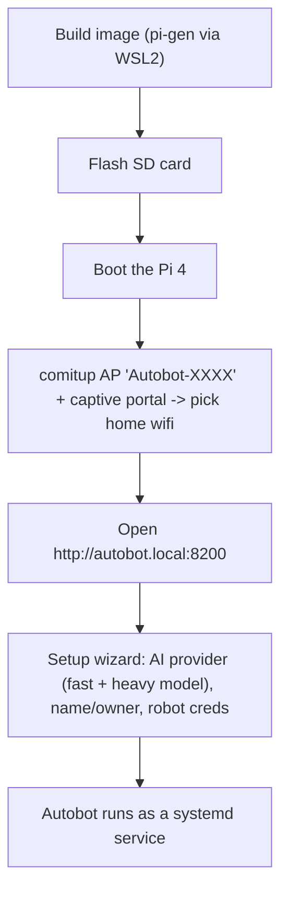

# Deploying Autobot to a Raspberry Pi (flashable image)

The turnkey path: build one SD-card image, flash it, boot the Pi, pick wifi from your phone, then finish a
web setup wizard. No keyboard/monitor needed.



## 1. Build the image

The reliable, tested path builds a **64-bit (arm64)** image on a proven arm64 pi-gen base via WSL2 + Docker.
From WSL2 (Ubuntu/Debian) with Docker Desktop integration, repo on the Linux filesystem:

```bash
# one-time: sudo apt-get install -y qemu-user-static binfmt-support rsync git
cd webui && npm install && npm run build && cd ..
GLIMMR_PIGEN=/path/to/arm64-pi-gen bash deploy/pi-gen/glimmr/build.sh
# output: ~/autobot-img/deploy/image_*-autobot-lite.zip  (flash the .zip directly)
```

Why this path: upstream `pi-gen`/`rpi-image-gen` default to 32-bit (armhf) and trip over Docker Desktop's
binfmt/i386 handling. The orchestrator in [`deploy/pi-gen/glimmr/`](../deploy/pi-gen/glimmr/) builds on a
known-good **arm64** pi-gen base (amd64 `debian:bookworm` builder + `qemu-aarch64-static :F` fix-binary
registration + comitup), strips its app-specific bits, and layers an Autobot install substage on top. There
is no native-Windows Pi builder — WSL2 + Docker is the Windows path (or any Linux box / CI).

> Note: the install runs under QEMU emulation, so `apt`/`pip` are slow — a full build can take ~30-60 min.
> The pip step pins PyPI (not piwheels) because piwheels' TLS is flaky under emulation.

The earlier [`deploy/pi-gen/build-wsl.sh`](../deploy/pi-gen/build-wsl.sh) (upstream pi-gen, armhf) is kept
for reference but the `glimmr/` arm64 path is the one that's been built end-to-end.

## 2. Flash + first boot

1. Flash the `*-autobot.img.*` with Raspberry Pi Imager / Etcher.
2. Boot the Pi. With no known wifi it raises an AP **`Autobot-XXXX`** (comitup).
3. Join that AP from a phone; the captive portal lets you choose your home wifi + password.
4. Browse to **`http://autobot.local:8200`**.

## 3. Setup wizard

- **AI provider** — choose one (OpenAI, OpenRouter, Ollama, LM Studio, Groq, or custom). It suggests a
  **fast** model (every interaction) and a **heavy** model (once-a-day memory cleanup/summarization).
- **Identity** — name the robot and set yourself as owner/maker.
- **Robot credentials** — capture your EBO's TUTK secrets once via the collector. The phone app is found on
  your LAN over **mDNS**; credentials are provisioned to the Pi at runtime (never baked into the image).
  *(This step finishes wiring once the mDNS collector rewrite lands.)*

## What's on the image vs. provisioned at runtime

| Baked into the image | Provisioned at runtime |
|----------------------|------------------------|
| Autobot app + venv, web UI, mediamtx, ffmpeg, espeak-ng | Robot secrets (`EBO_*`) |
| comitup (wifi onboarding), avahi (`autobot.local`) | TUTK `.so` libs + `ioctl9930.bin` (from the collector) |
| `autobot.service` (systemd), bundled bionic runtime | AI provider/model + persona (set in the wizard) |

## Operating

- The app runs as `autobot.service` (`systemctl status autobot`). Logs: `journalctl -u autobot -f`.
- Runtime config: `/etc/autobot/autobot.env`. App data (memory, faces): `/opt/autobot/data/`.
- To re-run wifi onboarding, use comitup (`comitup-cli`) or forget the network.
