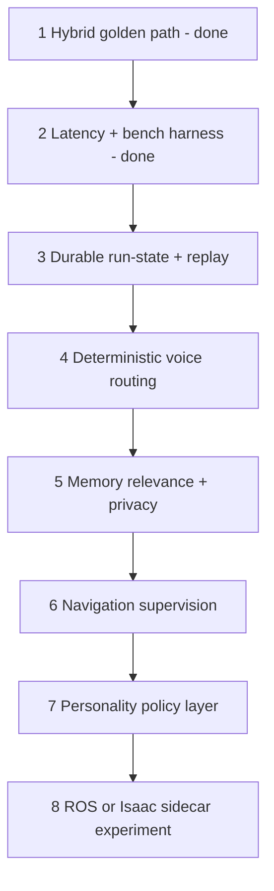

# FreeBo maturity guide

This is the actionable engineering plan that turns the evaluation in [`LevelUp.md`](../LevelUp.md) into work.
It maps each maturity gap to concrete files in this repo, in priority order, with a goal, the current state,
file-level steps, a success metric, and the main risk. Keep it honest: FreeBo's strength is **embodied,
local-first, operator-visible control with a hard safety floor** ([docs/SAFETY.md](SAFETY.md)). The point of
"maturity" is to make that core more **measurable, replayable, and reliable** — not to bolt on a generic
multi-agent framework.

Status legend: **done** (shipped in this pass) · **partial** (exists, needs work) · **todo** (not started).

| # | Item | Priority | Status |
|---|------|----------|--------|
| 1 | [Hybrid golden path](#1-hybrid-as-the-golden-path) | Highest | done (config-driven + fail-soft) |
| 2 | [Latency & benchmark harness](#2-latency--benchmark-harness) | Highest | done (instrumented + bench + api) |
| 3 | [Durable run-state / replay](#3-durable-run-state--replay) | Highest | todo |
| 4 | [Deterministic voice routing](#4-deterministic-voice-routing) | High | partial |
| 5 | [Memory relevance + privacy metadata](#5-memory-relevance--privacy-metadata) | High | partial |
| 6 | [Navigation supervision](#6-navigation-supervision) | High | partial |
| 7 | [Personality policy layer](#7-personality-policy-layer) | Medium | todo |
| 8 | [ROS 2 / Isaac sidecar](#8-ros-2--isaac-sidecar-experiment) | Medium | todo (deferred) |
| 9 | [Release-gating metrics](#9-release-gating-metrics) | cross-cutting | partial |

The whole brain lives in [`autobot/brain/`](../autobot/brain); see [docs/AI_BRAIN.md](AI_BRAIN.md) for how the
loop works today.

---

## 1. Hybrid as the golden path

**Goal.** Make the reflex + eyes + cortex hybrid (a small VLM as continuous "eyes", a compact tool-calling
LLM as the cortex, a non-LLM ToF reflex) the *recommended, well-supported, gracefully-degrading* path —
without making it a hard default that breaks hardware-free dev when no VLM service is running.

**Current state (after this pass): done.**

- Brain mode is now a single source of truth on `Settings`, not scattered `os.environ` reads. See
  `Settings.brain_mode()` in [`autobot/config.py`](../autobot/config.py) returning `single|hybrid|vlm|omni`.
  Because `ai_provider` is seeded from `AUTOBOT_AI_PROVIDER` at startup and is UI-editable, env stays a
  deploy-time default while the UI is authoritative at runtime.
- The mode helpers in [`autobot/brain/vlm_client.py`](../autobot/brain/vlm_client.py) and
  [`autobot/brain/omni_client.py`](../autobot/brain/omni_client.py) (`hybrid_enabled`,
  `vlm_perception_enabled`, `vlm_enabled`, `omni_enabled`) accept an optional `Settings` and resolve from it,
  falling back to env only for legacy no-arg callers and the `AUTOBOT_VLM_URL`/`AUTOBOT_OMNI_URL` triggers.
- **Fail-soft fallback.** When hybrid is selected but the VLM "eyes" service is unreachable, the brain logs
  once and falls back to single-model perception (the cortex gets the camera frame directly) instead of going
  blind. Implemented via `VlmClient.healthy()`, `AgentBrain._vlm_health()`, `_record_vlm_health()`, and
  `_vlm_perception_active()` in [`autobot/brain/agent.py`](../autobot/brain/agent.py). The resolved mode and
  VLM health surface in `status_dict()` (`brain_mode`, `vlm_ok`).

**Remaining steps (follow-ups).**

- Surface `brain_mode` + `vlm_ok` as a small badge in the dashboard (`webui/src/components/`) and offer the
  hybrid/vlm/omni options in the setup wizard catalog (`autobot/brain/providers/catalog.py`).
- One-command bringup: `scripts/run_vlm.ps1` (Windows) / a `scripts/run_vlm.sh` plus a documented `.env`
  block; see [docs/AI_BRAIN.md](AI_BRAIN.md).

**Success metric.** Hybrid beats single-model on control-loop responsiveness (see §2) and survives a VLM
service restart with no crash and automatic recovery.

**Risk.** Sending an image to a text-only cortex when the VLM is down is wasted tokens; it is logged and is
strictly better than going blind. Don't make hybrid a hard process default (would break no-VLM dev boxes).

---

## 2. Latency & benchmark harness

**Goal.** Turn "feels responsive" into numbers. Measure time-from-signal-to-action per stage so every release
is comparable on identical traces.

**Current state (after this pass): done.**

- New stdlib-only recorder [`autobot/brain/metrics.py`](../autobot/brain/metrics.py): per-phase rolling
  windows -> `count / p50 / p95 / p99 / mean / max / last` (ms), a `timer()` context manager, and optional
  JSONL export gated by `AUTOBOT_METRICS_LOG`.
- The agent owns `self.metrics` and records these phases in
  [`autobot/brain/agent.py`](../autobot/brain/agent.py): `reason` (full cycle), `perceive`, `provider`
  (each cortex LLM call), `tool` (each tool execution), `vlm_perceive` (hybrid eyes), `caption` (classic
  hybrid), `vlm_decide` (whole-brain VLM), `omni`, and `reflex_stop`.
- `GET /api/metrics` in [`autobot/web/server.py`](../autobot/web/server.py) returns the full snapshot; a
  compact summary rides in `status_dict()` under `metrics`.
- Offline benchmark [`scripts/bench_brain.py`](../scripts/bench_brain.py) drives N ticks against
  `MockRobotLink` with a stubbed provider (no hardware/GPU/network) and prints a per-phase p50/p95 table.
- Tests: [`tests/test_metrics.py`](../tests/test_metrics.py).

**How to use.**

```bash
python scripts/bench_brain.py --ticks 50        # offline per-phase latency table
curl localhost:8200/api/metrics                 # live snapshot from a running robot
AUTOBOT_METRICS_LOG=data/metrics.jsonl python -m autobot   # stream raw samples to disk
```

**Success metric.** A regression in any phase's p95 is visible in CI/bench output before release.

**Risk.** Instrumentation must stay cheap (perf_counter + a deque append under a lock) and never throw into
the loop — it is wrapped fail-soft.

**Next.** Wire `scripts/bench_brain.py` (or a `pytest-benchmark` test) into CI and store a baseline; add the
end-to-end voice metrics (wake -> STT -> first token) once voice routing (§4) lands.

---

## 3. Durable run-state / replay

**Goal.** Make a "turn" reconstructable after the fact — the trigger, observation, thoughts, tool calls,
results, approvals, and interrupts — so robot behavior is auditable and debuggable (LangGraph / OpenAI
sessions style, but lightweight and local).

**Current state: todo.** Only `data/memory/` and `data/tasks.json` persist. Conversation `history`, the
`PerceptionBuffer`, and the 300-event WebSocket ring (`_event_ring` in
[`autobot/web/server.py`](../autobot/web/server.py)) are in-memory and lost on restart.

**Steps.**

1. Add `autobot/brain/runlog.py`: an append-only JSONL "turn log" under `data/runs/<date>.jsonl`, one record
   per reason cycle: `{turn_id, ts, trigger, scope, mode, observation_summary, thoughts[], tool_calls[],
   results[], approvals[], duration_ms}`. Atomic append + size rollover, mirroring `memory.py` conventions.
2. Emit a `turn_id` (monotonic + uuid) at the top of `AgentBrain._reason()` and thread it through the events
   already emitted (`thought`, `tool_call`, `tool_result`, `observation`) so the UI and the run log share it.
3. Write one run record at the end of `_reason()` (and the VLM/omni paths) from the data already collected.
4. Add `GET /api/runs?limit=` and a "Replay" tab in `webui/` that lists turns and expands a turn into its
   event timeline (reuse the existing thought/action renderers).
5. Optional: a `--replay <turn_id>` mode in a script that re-feeds a stored observation to the cortex with the
   same prompt for prompt-regression testing (no robot motion — dry run).

**Success metric.** Any past turn can be reconstructed end-to-end from disk; a prompt change can be
A/B-replayed against recorded observations.

**Risk.** Don't log secrets or full image bytes (store a frame hash / thumbnail path, per
[docs/SAFETY.md](SAFETY.md) and the secrets rules). Keep writes off the hot path (thread/queue).

---

## 4. Deterministic voice routing

**Goal.** Route command-and-control utterances (especially Home Assistant intents) through deterministic
handlers before falling back to the open LLM, the way Home Assistant Assist partitions wake -> STT -> intent
-> TTS. Faster, cheaper, and far more predictable for "turn on the hallway light".

**Current state: partial.** [`autobot/brain/commands.py`](../autobot/brain/commands.py) already does fast
keyword routing for body intents (STOP/QUIET/SLEEP/HOME/COME/...). Home Assistant is **LLM-only**
([`autobot/brain/skills/home_assistant.py`](../autobot/brain/skills/home_assistant.py)) — there is no phrase
router for device control.

**Steps.**

1. Add `autobot/brain/intent_router.py`: a small, ordered matcher that maps utterances to a structured intent
   `{domain, action, target}` for the high-value deterministic cases (lights/switches/scenes by friendly
   name). Source the friendly-name list from the HA skill's `list_entities`.
2. Call the router in `AgentBrain.feed_speech()` (after the existing `commands.match`, before posting a
   `speech` event). On a confident match, execute via the HA skill directly through the safety/authority gate
   and skip the LLM round; on low confidence, fall through to the cortex as today.
3. Keep it owner-gated exactly like the `home_assistant` tool authority; never bypass
   [`autobot/brain/identity.py`](../autobot/brain/identity.py) or [`autobot/brain/safety.py`](../autobot/brain/safety.py).
4. Record an `intent` metric (matched / fell-through) via §2 so routing accuracy is measurable.

**Success metric.** Home-control commands complete without an LLM call at a high match rate, with a low
accidental-open-routing rate.

**Risk.** Over-eager matching that hijacks a conversational sentence — bias toward precision (require a
device/verb pair) and always allow a "no, I meant..." fall-through.

---

## 5. Memory relevance + privacy metadata

**Goal.** Recall the right facts more often without bloat, and make memory trustworthy by tagging provenance
and privacy scope.

**Current state: partial.** [`autobot/brain/memory.py`](../autobot/brain/memory.py) stores `facts.json`,
`daily/*.jsonl`, `sightings.jsonl` with `kind/ts/source`, exact-text dedup, keyword + optional embedding
recall ([`autobot/brain/embeddings.py`](../autobot/brain/embeddings.py)), and a daily summarizer. Missing:
confidence, privacy scope, staleness decay, contradiction handling, semantic dedup.

**Steps.**

1. Extend the `Fact` dataclass with `confidence: float`, `privacy: str` (`public|home|owner`), and
   `last_seen: float`; default sensibly and keep backward-compatible loads (missing fields -> defaults).
2. Filter prompt injection by privacy scope in `summary_for_prompt()` (don't surface `owner`-scoped facts in
   non-owner contexts), aligning with [`autobot/brain/identity.py`](../autobot/brain/identity.py).
3. Semantic dedup at write time: if an embedding is available and a new fact is > threshold-similar to an
   existing one, merge/boost confidence instead of appending.
4. Staleness: decay confidence with age in recall scoring; let the daily summarizer drop low-confidence,
   long-unseen facts. Contradiction: when a new fact strongly contradicts an old one, mark the old one
   superseded rather than keeping both.
5. Add recall-quality counters (precision@k proxy, duplicate rate) via §2.

**Success metric.** Higher recall precision@k, lower duplicate/stale rates, no `owner`-scoped leakage in
shared contexts.

**Risk.** Over-aggressive merging that loses distinct facts; keep merges reversible in the daily log.

---

## 6. Navigation supervision

**Goal.** Roam less repetitively and dock more reliably; make the topological place graph actually drive
routing instead of being write-only.

**Current state: partial.** [`autobot/brain/skills/places.py`](../autobot/brain/skills/places.py) stores
named places (JPEG + ahash + optional pose) and takes one safety-clamped step per `go_to_place` call; the
`graph.jsonl` edges are appended but never read. [`autobot/brain/slam.py`](../autobot/brain/slam.py) provides
advisory monocular pose; [`autobot/brain/curiosity.py`](../autobot/brain/curiosity.py) nudges away from
repeated paths and visited cells; [`autobot/brain/patrol.py`](../autobot/brain/patrol.py) is prompt-driven.
See [docs/NAVIGATION.md](NAVIGATION.md).

**Steps.**

1. Read the place graph in `go_to_place`: BFS/Dijkstra over `graph.jsonl` to pick the next *adjacent* place to
   head toward when the target isn't directly visible, instead of a blind forward nudge.
2. Add coverage/repeat/docking counters (patrol coverage, repeated-path rate, obstacle-intervention rate,
   docking success) via §2, surfaced in the UI.
3. Make patrol schedule real routes over saved places (round-robin least-recently-visited) rather than only
   nudging the prompt.

**Success metric.** Lower repeated-path rate, higher patrol coverage and docking success.

**Risk.** Monocular pose is up-to-scale and advisory — never treat graph routing as metric truth; keep every
move clamped by `safety.check_drive` and the reflex/deadman layers.

---

## 7. Personality policy layer

**Goal.** Make "playful, a little annoying, but useful" tunable instead of prompt-fragile. Separate the
character policy (bands: default / nudge / hard-stop) from the safety-critical prompt.

**Current state: todo.** Persona is composed into the system prompt in
`AgentBrain.build_system_prompt()` ([`autobot/brain/agent.py`](../autobot/brain/agent.py)); behavior scope,
identity, and safety are separate mechanical layers, but there is no dedicated personality module.

**Steps.**

1. Add `autobot/brain/persona.py` with three bands and tunables (talk frequency, nudge cadence, quiet hours),
   reading config from `Settings`. Default band: short observational comments. Nudge band: task-shaped
   reminders ("charger's still under the sofa"). Hard-stop band: all-business (obstacle/privacy/approval).
2. Have `build_system_prompt()` ask `persona.py` for the active band's guidance instead of inlining tone
   rules; keep the safety reminder fixed and separate.
3. Add a "useful vs annoying" weekly score input (UI thumbs) and rate-limit talk via the band, measured in §2.

**Success metric.** Talk frequency / nudge acceptance become tunable; the safety prompt is untouched by tone
changes.

**Risk.** Don't let persona logic reach motion/talk gates — those stay in [`safety.py`](../autobot/brain/safety.py).

---

## 8. ROS 2 / Isaac sidecar experiment

**Goal.** Decide whether deeper robotics middleware (Nav2 costmaps, lifecycle nodes, Isaac VSLAM/nvblox) is
worth adopting *below* the LLM layer — only after §1–§3 metrics exist.

**Current state: todo (deferred).** Intentionally last. FreeBo should not reinvent Nav2 inside `agent.py`.

**Steps.** Prototype a ROS 2 sidecar that publishes pose/costmap and exposes a `go_to(pose)` the places skill
can call; compare VSLAM quality and CPU/GPU overhead against the current monocular approach; keep it optional
and behind a config flag so the no-ROS path always runs.

**Success metric.** A clear yes/no on integration cost vs. navigation-quality gain, backed by numbers.

**Risk.** Scope explosion. Treat as an experiment with an exit criterion, not a rewrite.

---

## 9. Release-gating metrics

Track these and treat them as release gates (the harness in §2 makes most computable):

- **Latency (p50/p95/p99):** signal -> action: wake->STT, STT->first token, first token->first tool call,
  tool call->motor command, obstacle event->stop, camera-frame-age at decision.
- **Memory:** recall precision@k, memory growth rate, duplicate/stale rate, contradiction rate.
- **Safety:** forbidden-action block rate, false-approval rate, false-motion attempts, recovery-after-provider-failure,
  obstacle-stop latency. Because the safety floor is strong, these should be visible gates
  ([docs/SAFETY.md](SAFETY.md)).
- **UX:** speech frequency, user-interruption frequency, owner-approval burden, task-completion rate, and a
  weekly **"useful vs annoying"** score. A home robot wins by being invited to stay powered on.

---

## Sequencing



Items 1 and 2 ship in this pass; the rest are specified above as the next phases.
